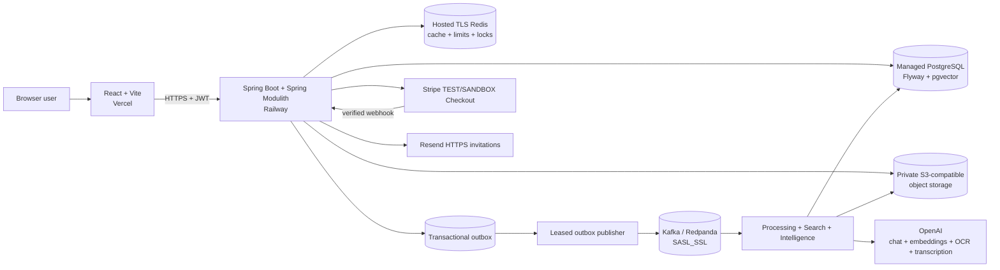
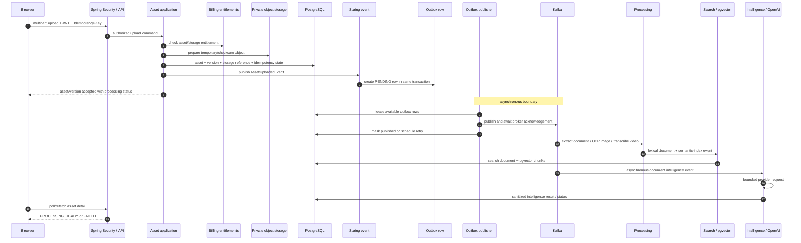

# AssetSphere

AssetSphere is an **event-driven multimodal knowledge and asset intelligence platform** for secure, version-aware team knowledge.

Teams do not merely store files. Knowledge changes across documents, images, videos, and versions, while traditional storage leaves retrieval, change understanding, and governance fragmented. AssetSphere turns those assets into an authorized, searchable knowledge workspace with grounded AI and explicit operational controls.

> **Your knowledge changes. AssetSphere understands what changed.**

## Live Demo

- [AssetSphere web app](https://assetsphere-mu.vercel.app)
- [Swagger API](https://assetsphere-production.up.railway.app/swagger-ui/index.html)
- [Backend health](https://assetsphere-production.up.railway.app/actuator/health)

The deployed hackathon payment path uses **Stripe TEST/SANDBOX**. It requires no real payment.

## Judge / Reviewer — Start Here

There are two complementary ways to evaluate AssetSphere:

### Path A — Product Walkthrough Using the Deployed Frontend

Open the [AssetSphere web app](https://assetsphere-mu.vercel.app). This is the fastest way to understand the complete workspace journey, async status handling, multimodal assets, versioning, grounded AI, collaboration, and SaaS controls.

### Path B — Backend Verification Using Swagger

Open the [production Swagger UI](https://assetsphere-production.up.railway.app/swagger-ui/index.html). The walkthrough below gives the exact endpoint order, request bodies, headers, IDs to copy, and expected responses. It is intended for reviewers who want to verify backend behavior independently of the UI.

Evaluation labels used below:

- **Immediate:** safe to test with a newly registered account.
- **Plan-gated:** the backend may require PRO/ENTERPRISE or available monthly quota.
- **Prepared workspace recommended:** asynchronous AI/media work is easier to review from an existing READY asset.
- **Operator-only:** feature-gated operational behavior, not required for normal judging.

## 10-Minute Product Evaluation

The steps are grouped for a short review; the complete feature set does not need to be exercised in exactly ten minutes.

### 1. Sign In and Select a Workspace — Immediate

- **Open/click:** Use **Get started**, **Sign in**, or **Continue with Google**. After authentication, use the workspace selector or **Create workspace**.
- **Action:** Register with an unused email, sign in, or use Google OAuth; then open the default workspace or create another workspace.
- **Capability proved:** Authentication, Google OAuth, workspace creation, membership-aware navigation, and workspace isolation.
- **Backend concept:** Spring Security/JWT, optional OAuth adapter, `WorkspaceAccessFacade`, and workspace-scoped persistence.
- **Expected result:** The sidebar shows **Overview**, **Assets**, **Search**, **Ask AssetSphere**, **Insights**, **Members**, **Billing & plan**, and **Settings** for the selected workspace.

### 2. Upload and Observe Processing — Immediate for documents; prepared workspace recommended for media

- **Open/click:** Open **Assets** → **Upload asset**.
- **Action:** Upload a small TXT or PDF containing a distinctive sentence such as a sample remote-work policy. The picker also supports DOCX, Markdown, CSV, JSON, XLSX, PPTX, PNG, JPEG, WebP, MP4, and WebM.
- **Capability proved:** Multipart upload, validation, private object storage, idempotent asset creation, and asynchronous multimodal processing.
- **Backend concept:** Request fingerprint/idempotency record, checksum storage deduplication, temporary/canonical object compensation, Spring event + transactional outbox, Kafka processing, and Redis upload limiting/processing lock.
- **Expected result:** Upload progress is shown, then the asset appears with an honest status such as **UPLOADED**, **QUEUED**, or **PROCESSING** before becoming **READY** or **PARTIALLY_PROCESSED**. A terminal processing problem is shown as **FAILED** rather than hidden.

### 3. Inspect Metadata, Version, and Download — Immediate after upload

- **Open/click:** Select the asset from **Assets**.
- **Action:** Review **Asset details**, the current version number, MIME/type, size, status, and **Version history**; click **Download Version 1**.
- **Capability proved:** Authorized metadata access, exact-version history, and private binary download.
- **Backend concept:** Logical `Asset` vs immutable `AssetVersion`, workspace predicates, storage reference lookup, and streamed backend download.
- **Expected result:** The downloaded filename matches the stored version. The page identifies the version being viewed and does not overwrite history.

### 4. Compare Lexical, Semantic, and Hybrid Search — Immediate after READY indexing

- **Open/click:** Open **Search**. The UI exposes **Hybrid**, **Semantic**, and **Lexical** mode buttons.
- **Action:** Search a phrase that exists in the prepared asset, then try a meaning-related phrase. Repeat in each mode.
- **Capability proved:** Exact-term retrieval, embedding similarity, and deterministic combined ranking.
- **Backend concept:** PostgreSQL full-text search, OpenAI query embeddings, pgvector `<=>`, and Reciprocal Rank Fusion in `SearchApplicationService`.
- **Expected result:** Lexical favors exact words/phrases, Semantic favors related meaning, and Hybrid balances both. Results show the exact latest version and allow version download.

### 5. Ask AssetSphere and Inspect Citations — Immediate if Ask quota remains

- **Open/click:** Open **Ask AssetSphere**.
- **Action:** Ask a question answerable from the uploaded text, for example: “What does the policy say about remote work?”
- **Capability proved:** Workspace-grounded RAG and trusted citations.
- **Backend concept:** Hybrid Search evidence API, bounded context, deterministic `S1...` assignment, entitled model selection, unknown-citation removal, and application-owned source metadata.
- **Expected result:** A **Grounded answer** appears with **Sources** cards containing source IDs, asset links, and snippets. If no evidence exists, AssetSphere returns “I couldn't find enough information in this workspace to answer that.” with no citations and no model call.

### 6. Generate Exact-Version Intelligence — Quota-controlled; prepared READY asset recommended

- **Open/click:** Return to the asset detail page and find **AI intelligence**.
- **Action:** Choose the plan default or an available model and click **Generate AI Insights** if the version shows **NOT_GENERATED**.
- **Capability proved:** On-demand exact-version summarization with sanitized output.
- **Backend concept:** Version-scoped content facade, backend model entitlement validation, usage metering, provider-neutral model port, bounded input, and result sanitizer.
- **Expected result:** The UI can show **Generating AI insights**, then a summary, key points, and tags. Provider or validation failures produce an honest retryable/failed state; the asset remains available.

### 7. Append a Version and Run Evolution Intelligence — Immediate for versioning; quota-controlled for comparison

- **Open/click:** On asset detail, click **Upload new version**; then use **Compare versions**.
- **Action:** Upload a changed revision of the same logical file, wait for its processing status, inspect newest-first **Version history**, select two different versions, and explicitly click **Compare Versions**.
- **Capability proved:** V1→V2 logical versioning, exact-version download, and bounded change analysis.
- **Backend concept:** Pessimistic asset lock for version numbering, immutable `AssetVersion`, reused idempotency/storage/outbox flow, and two-version Evolution model port.
- **Expected result:** The asset identity remains unchanged, the latest version increments, both versions remain downloadable, and Evolution shows an executive summary plus key changes/additions/removals/important changes. Changing the comparison selection does not automatically call the model.

### 8. Review Members, Invitations, RBAC, and Activity — OWNER for mutations; MEMBER can inspect allowed views

- **Open/click:** Open **Members**, then return to **Overview** for recent activity.
- **Action:** As OWNER/ADMIN, create an invitation for `<INVITEE_EMAIL>` with role **MEMBER**. If using a second owned account, accept the single-use link and compare OWNER vs MEMBER controls.
- **Capability proved:** Email-bound invitations, Resend delivery/manual-copy fallback, role enforcement, and durable audit activity.
- **Backend concept:** Workspace authorization before data access, invitation token/expiry/ownership checks, `AuditService`, and bounded activity query.
- **Expected result:** The member list shows real role/status data. OWNER/ADMIN mutation controls are not shown to a MEMBER. Activity records meaningful workspace actions; normal application logs are not presented as audit history.

### 9. Inspect Plans, Usage, and Stripe State — OWNER; Stripe actions are TEST/SANDBOX

- **Open/click:** Open **Billing & plan**.
- **Action:** Review current FREE/PRO/ENTERPRISE entitlements and usage. Optionally start **Upgrade to PRO** only if you want to inspect hosted Stripe TEST Checkout; no real payment is required.
- **Capability proved:** Backend-authoritative quotas, provider-neutral checkout, verified subscription synchronization, and cancel-at-period-end presentation.
- **Backend concept:** Atomic usage accounting, owner-only billing mutation, `PaymentGateway`, backend-owned pricing, verified Stripe webhook state, and stale/duplicate provider-event protection.
- **Expected result:** Usage values come from the backend. A Checkout return message never grants PRO by itself; the page refetches verified billing state. For an active recurring Stripe subscription, cancellation scheduling keeps access active until the displayed period end.

### 10. Inspect Image OCR and Video Transcription — PRO/ENTERPRISE; prepared workspace recommended

- **Open/click:** In **Assets**, open a prepared READY PNG/JPEG/WebP and a prepared READY MP4/WebM, or upload small supported samples in an entitled workspace.
- **Action:** Search or ask about visible image text and spoken video content; open exact-version Intelligence where available.
- **Capability proved:** Multimodal ingestion feeds the same retrieval/intelligence architecture as documents.
- **Backend concept:** Format-specific extractor dispatch, entitlement-aware `OpenAiImageOcrProvider` and `OpenAiMediaTranscriptionProvider`, bounded text normalization, then normal lexical/semantic/intelligence pipelines.
- **Expected result:** Media assets transition through the same honest processing states. Once READY, extracted OCR/transcript knowledge is searchable and available to grounded features. On FREE, OCR/video entitlement rejection is surfaced rather than silently bypassed.

**Not required for normal evaluation:** DLT inspection/replay is a feature-gated OWNER/ADMIN operator workflow. The deployed FREE-plan OCR denial verified retry through DLT, but exhaustive production replay is not claimed.

## Backend Verification with Swagger

### Endpoints and Authorization

- **Production Swagger:** https://assetsphere-production.up.railway.app/swagger-ui/index.html
- **Local Swagger entrypoint:** http://localhost:8080/swagger-ui.html (Springdoc redirects to `/swagger-ui/index.html`)
- **Production API base:** `https://assetsphere-production.up.railway.app/api/v1`
- **Local API base:** `http://localhost:8080/api/v1`

Responses normally use the envelope:

```json
{
  "success": true,
  "data": {},
  "timestamp": "<UTC_TIMESTAMP>",
  "correlationId": "<CORRELATION_ID_OR_NULL>"
}
```

The OpenAPI scheme is HTTP `bearer` with JWT format. After login, copy `data.accessToken`, click Swagger's **Authorize** button, and paste the **raw token only** (`<JWT>`). Swagger adds the `Bearer` prefix. Do not paste `Bearer <JWT>` into that field.

Use unique placeholder values and never publish a real password, token, invitation link, or payment secret.

### Authentication

#### 1. Register

- **Purpose:** Create a user and its default workspace.
- **Method/route:** `POST /api/v1/auth/register`
- **Auth/headers:** Public; `Content-Type: application/json`.
- **Body:**

```json
{
  "email": "judge@example.com",
  "password": "<PASSWORD_WITH_UPPER_LOWER_AND_DIGIT_12+>",
  "displayName": "Hackathon Judge"
}
```

- **Expected status:** `201 Created`.
- **Copy:** `data.user.id` if desired and `data.defaultWorkspace.id` as one possible `<WORKSPACE_ID>`.
- **Next:** Registration does not return tokens; call Login separately.
- **Engineering evidence:** Password policy/BCrypt, normalized identity, default workspace transaction, and public-route security configuration.

#### 2. Login

- **Purpose:** Obtain an access/refresh token pair.
- **Method/route:** `POST /api/v1/auth/login`
- **Auth/headers:** Public; `Content-Type: application/json`.
- **Body:**

```json
{
  "email": "judge@example.com",
  "password": "<PASSWORD>"
}
```

- **Expected status:** `200 OK`.
- **Copy:** `data.accessToken` as `<JWT>`. The response also contains `tokenType`, access/refresh expiry seconds, and `refreshToken`.
- **Next:** Authorize Swagger with the raw access token.
- **Engineering evidence:** JWT issuance and refresh-token lifecycle.

#### 3. Retrieve Current Identity

- **Purpose:** Confirm the authenticated user and workspace memberships.
- **Method/route:** `GET /api/v1/auth/me`
- **Auth/headers:** Bearer JWT through Swagger Authorize; no body.
- **Expected status:** `200 OK`.
- **Copy:** `data.workspaces[].id` and `role`; either use the default workspace or create a dedicated one below.
- **Engineering evidence:** Security-context identity plus membership projection. `GET /api/v1/auth/providers` separately reports whether Google OAuth is enabled.

### Workspace

#### 4. Create a Workspace

- **Purpose:** Create an isolated tenant owned by the current user.
- **Method/route:** `POST /api/v1/workspaces`
- **Auth/headers:** Bearer JWT; `Content-Type: application/json`.
- **Body:**

```json
{
  "name": "Judge Review Workspace",
  "slug": "judge-review-<UNIQUE_SUFFIX>",
  "description": "Temporary workspace for AssetSphere evaluation"
}
```

- **Expected status:** `201 Created`.
- **Copy:** `data.id` as `<WORKSPACE_ID>`.
- **Engineering evidence:** Workspace ownership creation, normalized API validation, and audit-aware persistence.

#### 5. List or Get the Workspace

- **Purpose:** Verify membership-filtered workspace access.
- **Method/routes:** `GET /api/v1/workspaces` and `GET /api/v1/workspaces/<WORKSPACE_ID>`.
- **Auth/headers:** Bearer JWT; no body.
- **Expected status:** `200 OK`.
- **Expected result:** The list includes only workspaces visible to the user; the detail response includes `id`, `name`, `slug`, `description`, and `status`.
- **Engineering evidence:** `WorkspaceAccessFacade` and workspace-scoped repository access.

### Asset Upload, Status, Versions, and Download

#### 6. Upload an Asset

- **Purpose:** Create a logical asset and Version 1.
- **Method/route:** `POST /api/v1/workspaces/<WORKSPACE_ID>/assets`
- **Auth/headers:** Bearer JWT; mandatory `Idempotency-Key: judge-upload-001`.
- **Body:** `multipart/form-data` with required part `file`; optional text fields `displayName` and `description`. Let Swagger set the multipart content type/boundary.
- **Suggested file:** A small TXT/PDF containing sample input such as “The remote work policy allows three remote days per week.” Results depend on the actual uploaded content.
- **Expected status:** `201 Created`.
- **Copy:** `data.assetId` as `<ASSET_ID>`, `data.assetVersionId` as `<ASSET_VERSION_ID>`, and `data.versionNumber` (initially `1`).
- **Important response:** `processingStatus`, MIME/type, checksum, and `X-Idempotent-Replay: false`.
- **Idempotency test:** Repeat the identical multipart request with the same key; expect replay without another asset and `X-Idempotent-Replay: true`. Reuse the key with a changed file/metadata; expect a conflict.
- **Engineering evidence:** Upload limiting, idempotency fingerprint/replay, checksum storage deduplication, storage compensation, asset/version transaction, and transactional outbox creation.

#### 7. List and Get the Asset

- **Purpose:** Inspect metadata and poll the real processing state.
- **Method/routes:** `GET /api/v1/workspaces/<WORKSPACE_ID>/assets?page=0&size=20` and `GET /api/v1/workspaces/<WORKSPACE_ID>/assets/<ASSET_ID>`.
- **Auth/headers:** Bearer JWT; no body.
- **Expected status:** `200 OK`.
- **Expected result:** The page envelope contains `content`, `page`, `size`, `totalElements`, and `totalPages`. Asset detail includes the IDs, current `versionNumber`, metadata, and `processingStatus`.
- **Async note:** A `201` upload means durable acceptance, not completed extraction/OCR/transcription/indexing. Refetch this existing asset endpoint; there is no invented separate polling API. Status can move through `UPLOADED`, `QUEUED`, `PROCESSING`, `READY`, `PARTIALLY_PROCESSED`, or `FAILED`.
- **Next:** Wait for `READY` or `PARTIALLY_PROCESSED` before expecting search/intelligence content.
- **Engineering evidence:** Honest eventual consistency plus Redis metadata cache/database fallback.

#### 8. List Version History

- **Purpose:** Retrieve immutable versions in the logical asset.
- **Method/route:** `GET /api/v1/workspaces/<WORKSPACE_ID>/assets/<ASSET_ID>/versions`
- **Auth/headers:** Bearer JWT; no body.
- **Expected status:** `200 OK`.
- **Copy:** `assetVersionId`, `versionNumber`, filename, MIME type, size, status, and timestamp for each row.
- **Engineering evidence:** Logical asset/version separation and preserved history.

#### 9. Download an Exact Version

- **Purpose:** Verify authorized private binary retrieval.
- **Method/route:** `GET /api/v1/workspaces/<WORKSPACE_ID>/assets/<ASSET_ID>/versions/1/download`
- **Auth/headers:** Bearer JWT; no body.
- **Expected status:** `200 OK` with `Content-Disposition: attachment`, stored MIME type, and content length.
- **Expected result:** Swagger/browser downloads the exact Version 1 bytes. The current version number can be read from Asset detail and used in the same route.
- **Engineering evidence:** Workspace/asset/version ownership checks plus provider-neutral storage streaming.

### Search

All modes use `GET /api/v1/workspaces/<WORKSPACE_ID>/search` with Bearer JWT. Query length is 1–200 characters; `page` starts at `0`; `size` is bounded. Sample input `remote work policy` is illustrative—the result depends on uploaded content.

#### 10. Lexical Search

- **Route/query:** `?q=remote%20work%20policy&mode=LEXICAL&page=0&size=20`
- **Expected status/result:** `200 OK`; exact words/phrases are favored. Results include `assetId`, `assetVersionId`, `versionNumber`, filename/display name, MIME type, status, rank, and snippet.
- **Engineering evidence:** PostgreSQL full-text retrieval with workspace/latest-version predicates.

#### 11. Semantic Search

- **Route/query:** `?q=remote%20work%20policy&mode=SEMANTIC&page=0&size=20`
- **Expected status/result:** `200 OK`; meaning-related content can match without identical wording. Semantic search is Redis rate-limited and requires the configured embedding provider.
- **Engineering evidence:** `EmbeddingModelPort`, 1536-dimensional OpenAI query embedding, pgvector `<=>`, and typed provider failure.

#### 12. Hybrid Search

- **Route/query:** `?q=remote%20work%20policy&mode=HYBRID&page=0&size=20`
- **Expected status/result:** `200 OK`; candidates combine lexical exactness and semantic meaning through deterministic RRF.
- **Engineering evidence:** Search-owned dual retrieval and reciprocal-rank fusion rather than direct score comparison.

### Grounded Ask and Intelligence

#### 13. Ask AssetSphere

- **Purpose:** Generate an answer from bounded trusted workspace evidence.
- **Method/route:** `POST /api/v1/workspaces/<WORKSPACE_ID>/ask`
- **Auth/headers:** Bearer JWT; `Content-Type: application/json`.
- **Body:**

```json
{
  "question": "What does the remote work policy allow?",
  "modelId": null
}
```

- **Expected status:** `200 OK` when provider/quota are available.
- **Expected result:** `data.answer` and `data.citations[]` containing `sourceId`, trusted asset/version IDs, title/filename, optional chunk ordinal, and snippet.
- **No-evidence result:** Exact deterministic answer `I couldn't find enough information in this workspace to answer that.` and `citations: []`; no model call occurs.
- **Engineering evidence:** Authorization before retrieval, RAG rate limit, Hybrid evidence API, bounded context, trusted citation filtering, and backend usage/model entitlement.

#### 14. Generate and Read Exact-Version Intelligence

- **Purpose:** Produce a summary/key points/tags for an exact processed version.
- **Method/route:** `POST /api/v1/workspaces/<WORKSPACE_ID>/assets/<ASSET_ID>/versions/1/intelligence/generate`
- **Auth/headers:** Bearer JWT; `Content-Type: application/json`.
- **Body:** `{}` for the plan default model, or `{ "modelId": "<AVAILABLE_MODEL_ID>" }` after consulting the UI/model catalog.
- **Expected status:** `200 OK` when the version is processable and quota/provider are available.
- **Expected result:** `status`, exact `assetVersionId`, `summary`, `keyPoints`, `tags`, provider/model, input truncation flag, and generation time.
- **Read route:** `GET /api/v1/workspaces/<WORKSPACE_ID>/assets/<ASSET_ID>/versions/1/intelligence` (`200 OK`).
- **Entitlement:** This consumes the current plan's AI insight allowance; model selection is validated server-side.
- **Engineering evidence:** Exact-version scoping, backend usage accounting, bounded input, provider port, and sanitizer.

#### Additional Grounded AI Endpoints

These are optional extensions to the core review flow:

- `GET /api/v1/workspaces/<WORKSPACE_ID>/ai/models` returns the server-authorized model catalog for the current workspace plan.
- `POST /api/v1/workspaces/<WORKSPACE_ID>/insights` and `POST /api/v1/workspaces/<WORKSPACE_ID>/assets/<ASSET_ID>/versions/<VERSION_NUMBER>/insights` accept `{ "type": "EXECUTIVE_BRIEF", "focus": null, "modelId": null }`. Supported types are `EXECUTIVE_BRIEF`, `KEY_DECISIONS`, `RISKS_AND_GAPS`, `ACTION_ITEMS`, `OPEN_QUESTIONS`, `CONTRADICTIONS`, and `KNOWLEDGE_CHECK`.
- `POST /api/v1/workspaces/<WORKSPACE_ID>/quiz` and `POST /api/v1/workspaces/<WORKSPACE_ID>/assets/<ASSET_ID>/versions/<VERSION_NUMBER>/quiz` accept fields `questionCount`, `difficulty` (`EASY`, `MEDIUM`, or `HARD`), optional `topic`, and optional `modelId`.

All require Bearer authentication, workspace authorization, applicable quota/model entitlement, bounded evidence or exact-version content, and explicit invocation; none runs automatically on page load.

### Versioning and Evolution

#### 15. Upload a New Version

- **Purpose:** Append Version 2+ to the existing logical asset.
- **Method/route:** `POST /api/v1/workspaces/<WORKSPACE_ID>/assets/<ASSET_ID>/versions`
- **Auth/headers:** Bearer JWT; mandatory `Idempotency-Key: judge-version-002`.
- **Body:** `multipart/form-data` with required `file` only.
- **Expected status:** `201 Created`.
- **Copy:** New `data.assetVersionId` and `data.versionNumber`; `assetId` remains unchanged.
- **Replay behavior:** Repeating the same file/key replays; changed content with the same key conflicts.
- **Engineering evidence:** Pessimistic asset lock, atomic next-version assignment, reused checksum storage, idempotency, and the same outbox processing pipeline.

#### 16. Re-list Versions

- **Method/route:** `GET /api/v1/workspaces/<WORKSPACE_ID>/assets/<ASSET_ID>/versions`
- **Auth/headers:** Bearer JWT.
- **Expected status/result:** `200 OK`; both Version 1 and Version 2 remain present with independent processing states and timestamps.
- **Engineering evidence:** Immutable history rather than file overwrite.

#### 17. Compare Versions with Evolution Intelligence

- **Purpose:** Compare two explicit authorized versions.
- **Method/route:** `POST /api/v1/workspaces/<WORKSPACE_ID>/assets/<ASSET_ID>/compare`
- **Auth/headers:** Bearer JWT; `Content-Type: application/json`.
- **Body:**

```json
{
  "fromVersion": 1,
  "toVersion": 2,
  "modelId": null
}
```

- **Expected status:** `200 OK` when both versions are processed and quota/provider are available.
- **Expected result:** `fromVersion`, `toVersion`, `executiveSummary`, `keyChanges`, `additions`, `removals`, and `importantChanges`.
- **Engineering evidence:** Same-workspace/same-asset exact-version validation, bounded two-source provider call, typed structured parsing, and sanitizer.

### Collaboration and Audit

#### 18. Invite a Member

- **Purpose:** Create an email-bound, expiring workspace invitation.
- **Method/route:** `POST /api/v1/workspaces/<WORKSPACE_ID>/invitations`
- **Auth/headers:** Bearer JWT as OWNER/ADMIN; `Content-Type: application/json`.
- **Body:**

```json
{
  "email": "<INVITEE_EMAIL>",
  "role": "MEMBER"
}
```

- **Expected status:** `201 Created`.
- **Expected result:** Invitation ID, invitee email, role, expiry, single-use acceptance URL/token, and `emailDeliveryStatus` (`SENT`, `DISABLED`, or `FAILED`). Do not publish the returned token/link.
- **Engineering evidence:** RBAC, normalized email ownership, expiry/single-use token, Resend/SMTP provider boundary, and manual-copy fallback.

#### 19. List Members

- **Method/route:** `GET /api/v1/workspaces/<WORKSPACE_ID>/members`
- **Auth/headers:** Bearer JWT.
- **Expected status/result:** `200 OK`; member ID/user ID, display name/email, role, status, and join time.
- **Engineering evidence:** Active-membership authorization and role-aware projection. Role mutation/removal routes exist for authorized OWNER/ADMIN workflows.

#### 20. Read Workspace Activity

- **Method/route:** `GET /api/v1/workspaces/<WORKSPACE_ID>/activity?page=0&size=20`
- **Auth/headers:** Bearer JWT.
- **Expected status/result:** `200 OK`; bounded entries contain audit ID, actor, action, resource type/ID, and occurrence time.
- **Engineering evidence:** Durable business audit separate from diagnostic logs.

### Billing

#### 21. Read Plans, Capabilities, and Workspace Billing

- **Methods/routes:** `GET /api/v1/billing/plans`, `GET /api/v1/billing/payment-capabilities`, and `GET /api/v1/workspaces/<WORKSPACE_ID>/billing`.
- **Auth/headers:** Use Bearer JWT for the evaluation flow; workspace billing requires active membership.
- **Expected status:** `200 OK`.
- **Expected result:** FREE/PRO/ENTERPRISE entitlements; selected provider capabilities; current plan/status, usage, remaining values, period, payment status/provider, renewal, and cancellation scheduling state.
- **Engineering evidence:** Backend-authoritative plan catalog, period usage, and provider selection.

#### 22. Create Stripe TEST/SANDBOX Checkout

- **Purpose:** Start a backend-priced PRO subscription attempt.
- **Method/route:** `POST /api/v1/workspaces/<WORKSPACE_ID>/billing/checkout`
- **Auth/headers:** Bearer JWT as OWNER; mandatory `Idempotency-Key: judge-checkout-001`; no request body/amount.
- **Expected status:** `200 OK`.
- **Expected result:** `provider: STRIPE`, provider session/order ID, hosted `checkoutUrl`, `supportsHostedCheckout: true`, backend-owned `amountMinor`/`currency`, and payment status.
- **Next:** The URL opens Stripe TEST/SANDBOX. Completing/abandoning the browser flow is not subscription authority; refetch workspace billing for verified state.
- **Engineering evidence:** Idempotent payment reservation, server-owned price, `PaymentGateway`, and hosted provider adapter.

#### 23. Schedule Cancel at Period End

- **Purpose:** Ask Stripe to cancel an active recurring subscription after its paid period.
- **Method/route:** `POST /api/v1/workspaces/<WORKSPACE_ID>/billing/cancel`
- **Auth/headers:** Bearer JWT as OWNER; no body.
- **Expected status:** `200 OK` for an active cancellable Stripe subscription.
- **Expected result:** A subsequent billing read can show `cancelAtPeriodEnd: true`; PRO access remains active until the authoritative period end.
- **Engineering evidence:** Provider cancellation capability and verified subscription synchronization. Future terminal cancellation at that date is not claimed as production-observed.

### Provider Callback Evidence — Do Not Invoke as a User API

`POST /api/v1/billing/webhooks/stripe` is a Stripe callback, not a judge/user command. `StripePaymentGateway` verifies the provider signature; `BillingWebhookService` idempotently claims/orders events; `ProviderPaymentConfirmationService` ties successful provider identity to the existing payment/workspace before subscription activation or synchronization. Browser redirects cannot grant PRO.

### Feature-Gated Operator Workflow — Not Required for Judging

When `ASSETSPHERE_DLT_OPS_ENABLED=true`, an OWNER/ADMIN can inspect `GET /api/v1/workspaces/<WORKSPACE_ID>/ops/dlt?limit=50` and replay one selected record with `POST /api/v1/workspaces/<WORKSPACE_ID>/ops/dlt/<TOPIC>/<PARTITION>/<OFFSET>/replay`. The controller may be absent from Swagger when disabled. Replay must target a record already proven to belong to the path workspace; this is not a normal product workflow.

## What AssetSphere Does

1. A user creates or joins an isolated workspace.
2. The user uploads a document, image, or video; an idempotency key makes retries safe.
3. AssetSphere stores the binary privately, records the asset/version transaction, and writes an outbox event.
4. Kafka consumers extract text, run image OCR or video transcription, build lexical and semantic indexes, and update honest processing states.
5. Workspace members use lexical, semantic, or hybrid search across the latest asset versions.
6. Ask AssetSphere retrieves bounded hybrid evidence and returns a grounded answer with application-authoritative citations.
7. Exact-version Intelligence produces summaries, key points, and tags; Evolution Intelligence compares two selected versions.
8. Owners manage versions, invitations, roles, plan entitlements, usage, and Stripe subscription state.

Verified upload categories are:

- **Documents:** PDF, DOCX, TXT, Markdown, CSV, JSON, XLSX, PPTX
- **Images:** PNG, JPEG/JPG, WebP through OCR
- **Video:** MP4 and WebM through transcription

## Why This Is More Than File Storage

- **Multimodal ingestion:** documents, OCR text, and video transcripts enter one bounded text-processing pipeline.
- **Version-aware knowledge:** immutable `AssetVersion` records preserve history instead of overwriting prior content.
- **Exact-version intelligence:** generation and comparison operate on explicitly authorized versions.
- **Complementary retrieval:** PostgreSQL full-text search and pgvector semantic search are combined through deterministic Reciprocal Rank Fusion (RRF).
- **Grounded answers:** RAG receives bounded evidence, uses deterministic source IDs, filters unknown citations, and avoids the model call when no evidence exists.
- **Workspace isolation:** backend authorization and workspace predicates protect every tenant boundary; frontend role states are not authoritative.
- **SaaS controls:** plan entitlements and usage are enforced before costly operations, while provider webhooks—not browser redirects—control subscription state.
- **Failure-aware processing:** idempotency, an outbox, leases, retries, DLTs, locks, and compensation address different failure boundaries without claiming distributed transactions or exactly-once delivery.

## System Architecture



Production uses private S3-compatible storage, Stripe, and Resend HTTPS. MinIO, SMTP, and `RAZORPAY_LOCAL` are development alternatives, not production dependencies.

## Why a Modular Monolith?

AssetSphere is one deployable Spring Boot application with explicit Spring Modulith business boundaries. This preserves simple operations and cross-module transactional consistency while preventing an unstructured “big ball of mud.” Named module APIs define allowed dependencies and persistence entities remain owned by their modules.

A microservice split would add network contracts, distributed tracing, deployment coordination, and cross-service consistency work before independent scaling is justified. The current design keeps those costs out of the MVP. If one workload later needs independent scaling, its existing API and provider boundaries provide a practical extraction seam—but no claim is made that extraction would be automatic.

## Backend Modules

| Module | Responsibility |
|---|---|
| `auth` | Registration/login, refresh-token rotation, JWT authentication, Google OAuth, and current-user security context |
| `workspace` | Workspaces, memberships, roles, invitations, authorization facade, and workspace-facing activity endpoint |
| `asset` | Asset metadata, immutable versions, uploads/downloads, lifecycle status, idempotency, and version concurrency |
| `storage` | Provider-neutral binary storage facade, checksum-based physical deduplication, reference counts, and compensation |
| `processing` | Extractor selection, bounded text extraction, processing orchestration, and the transactional outbox |
| `search` | Lexical index, semantic chunks/embeddings, pgvector retrieval, hybrid RRF, and bounded Search evidence API |
| `intelligence` | Document intelligence, Evolution, grounded Ask, insights, quizzes, AI model catalog, and result sanitization |
| `billing` | Plans, entitlements, usage accounting, checkout reservation, provider confirmation, and subscription lifecycle |
| `audit` | Durable business activity records and workspace activity queries |
| `common` | Shared exceptions, persistence auditing, security/time contracts, text safety, and web response types |
| `infrastructure` | Kafka, Redis, object-storage, OpenAI, Stripe/local-payment, email, and other external adapters |

Within feature modules, `api` packages expose controllers, DTOs, events, and named interfaces; `application` services orchestrate use cases; `domain` objects enforce lifecycle invariants; and `persistence` remains module-owned. Not every module needs every layer, so the convention is applied where it adds a real boundary rather than as ceremony.

## Architecture and Design Decisions

| Decision / pattern | Problem | AssetSphere implementation | Why chosen | Trade-off / rejected alternative |
|---|---|---|---|---|
| Spring Modulith modular monolith | A single codebase can become tightly coupled | `@ApplicationModule` declarations and named `::api` dependencies | One deployable with enforceable ownership and local transactions | Premature microservices would add operational and consistency overhead |
| Layered responsibilities | Controllers or persistence code can absorb business orchestration | Thin API controllers delegate to application services; domain entities own state transitions | Keeps HTTP, use-case, domain, and persistence concerns understandable | More types than a CRUD-only design |
| Dependency inversion | AI, storage, payment, and messaging providers can change | Interfaces such as `EmbeddingModelPort`, `WorkspaceQuestionAnsweringModel`, `AssetStorage`, `PaymentGateway`, and `OutboxMessagePublisher` have infrastructure adapters | Application code depends on capabilities, not SDKs | Adapter contracts must be maintained explicitly |
| Domain lifecycle invariants | Invalid asset/subscription transitions are easy to persist | `Asset`, `AssetVersion`, `Subscription`, `BillingPayment`, and `OutboxEvent` own transition methods | Centralizes valid state changes | Some persistence updates still use focused JDBC for atomicity/performance |
| Client idempotency + fingerprint | HTTP retries can duplicate uploads or checkouts | Idempotency key, normalized request fingerprint, replay response, and changed-request conflict | Safe retry semantics without treating all same-content uploads as the same logical asset | Clients must retain the key for a logical retry |
| Transactional outbox | Database commit and direct Kafka send can diverge | `@EventListener` plus `Propagation.MANDATORY` writes `OutboxEvent` in the originating transaction | Removes the DB/Kafka dual-write window | Publication remains asynchronous and at-least-once |
| Internal vs external events | Domain/application coordination and broker delivery have different guarantees | Spring application events create transactional outbox rows; the publisher later emits serialized Kafka events | Keeps transaction-local intent separate from external transport | Event schemas and versioning still require discipline |
| Duplicate-tolerant async design | Kafka and publisher retries may redeliver | Stable event IDs, processed-event checks, domain deduplication, locks, and idempotent state transitions | Handles at-least-once behavior honestly | No exactly-once claim; handlers must remain replay-safe |
| Leased outbox claiming | Multiple publisher instances can race | PostgreSQL `FOR UPDATE SKIP LOCKED`, claim owner, timestamp, batch size, and stale-lease recovery | PostgreSQL is already the durable ownership boundary | Polling adds small publication latency |
| Publisher acknowledgement + backoff | A send call can fail after an event is claimed | `KafkaTemplate.send(...).get(...)`; bounded exponential retry and terminal outbox failure state | Marks success only after broker acknowledgement | Waiting bounds throughput but makes state transitions clear |
| Consumer retry and DLT | Provider/transient failures should not loop forever | Topic-specific bounded backoff, non-retryable classification, DLT publication, safe root-cause logging | Separates recoverable attempts from terminal diagnosis | DLT handling is an operational workflow |
| Feature-gated DLT operations | Arbitrary replay is unsafe | OWNER/ADMIN scoped inspection and identity-preserving replay under an explicit config flag | Gives controlled recovery without a parallel database DLQ | Requires an operator decision |
| Pessimistic version lock | Concurrent append requests can choose the same number | `AssetRepository.findForUpdate(...)` locks the asset before `appendVersion()` | Small, database-native critical section | Concurrent appends serialize per asset |
| Redis metadata cache | Asset detail reads repeat stable metadata access | `RedisAssetMetadataCache`; mutation/processing paths evict, including after commit where needed | Improves reads without caching authorization state or entities | Redis failure falls back to database behavior |
| Redis rate limits | Expensive or abuse-prone entry points need bounded demand | Separate upload, semantic-search, and RAG limiters keyed by workspace/user | Protects infrastructure and provider cost | Limits require operational tuning |
| Redis distributed locks | Duplicate consumers can process one version concurrently | Token-owned processing, intelligence, and semantic-index locks | Coordinates work where a database row is not the natural claim boundary | Lock expiry must cover bounded work |
| Checksum storage deduplication | Identical bytes can waste object storage | Workspace-scoped SHA-256 lookup, canonical object key, and reference count | Saves physical storage without conflating logical assets | Deduplication is workspace-scoped and metadata remains separate |
| Temporary-to-canonical storage | Object storage cannot join a PostgreSQL transaction | Prepare temporary object, attach DB reference, materialize canonical key, and compensate on failure | Makes partial failure explicit without pretending to have a distributed transaction | Cleanup is compensating, not atomic across systems |
| Object storage instead of DB BLOBs | Large binaries burden transactional tables | Private provider-neutral `AssetStorage`; metadata and references remain in PostgreSQL | Separates binary throughput from relational queries | Requires lifecycle coordination |
| PostgreSQL full-text search | Exact terms and document language need efficient retrieval | Workspace/latest-version scoped lexical SQL and snippets | Uses an existing durable store and strong exact-match behavior | Lexical search alone misses semantic similarity |
| pgvector semantic retrieval | Meaning-based retrieval needs embedding distance | 1536-dimensional OpenAI embeddings and pgvector cosine-distance operator `<=>` | Avoids another vector database for the MVP | Embedding availability affects semantic results |
| Hybrid RRF | Lexical and semantic scores are not directly comparable | Deterministic reciprocal-rank contributions merged in `SearchApplicationService` | Robust combination without score calibration | Fixed fusion constant is a deliberate simple baseline |
| Retrieval separated from generation | Intelligence should not duplicate search SQL or trust the model for sources | Search owns evidence retrieval; Intelligence consumes bounded Search API DTOs | Clear ownership and independently testable grounding | Requires a stable evidence contract |
| Bounded RAG + trusted citations | Prompts can grow unbounded and models can invent sources | Source/count/character limits, `S1...`, unknown removal, deduplication, trusted metadata, deterministic no-evidence response | Limits data egress and keeps citations application-authoritative | Answers are intentionally constrained by retrieved evidence |
| Exact-version Intelligence/Evolution | Latest-only generation hides historical differences | Explicit version metadata/content facades and two-version comparison | Makes historical reasoning reproducible | Users must choose the versions intentionally |
| Workspace authorization | URL IDs alone cannot establish tenant access | `WorkspaceAccessFacade` before retrieval/provider calls plus workspace-scoped queries | Backend remains authoritative across all clients | Every new use case must include the boundary check |
| JWT + Spring Security | APIs need stateless authenticated identity | JWT filter, BCrypt, refresh rotation, optional Google OAuth, explicit public routes, and CORS policy | Standard security primitives with provider-optional login | Token lifecycle adds client/session complexity |
| Audit trail separate from logs | Operational logs are not a user-facing business history | `AuditService`, `AuditRecord`, and workspace activity query record actions and actors | Durable domain evidence without storing document content in logs | Audit retention needs policy as the system grows |
| Backend-authoritative billing | UI checks can be bypassed and concurrent quota use can overspend | Central plan properties, atomic usage repository operations, `consumeOnce`, and owner-only mutation APIs | Enforces entitlements at expensive boundaries | Correct period/provider event ordering is non-trivial |
| Payment gateway abstraction | Billing core should not contain provider SDK semantics | `PaymentGateway` with Stripe and development-only local adapters | Preserves one billing lifecycle across provider integrations | Provider-specific capabilities still need adapter logic |
| Verified webhook authority | Browser redirects can be forged or abandoned | Signature verification, provider-event idempotency/order state, and transactional confirmation | Subscription state follows the provider, not the browser | Webhook delivery and reconciliation must be observable |
| Immutable Flyway migrations | Shared database history must be reproducible | Versioned V1-V17 migrations applied by Flyway | Deterministic schema evolution | Released migrations are not edited; corrections require a new migration |
| Post-commit cache invalidation | Evicting before rollback can expose unnecessary misses/inconsistency | Transaction synchronization evicts asset metadata after successful commits on relevant paths | Cache follows committed database state | Adds explicit transaction hooks |
| Observability | Async failures need operational signals | Actuator health/readiness/liveness, Micrometer counters in Kafka/DLT/intelligence paths, correlation IDs, and safe identifier logging | Supports health checks and failure diagnosis without logging sensitive content | Full external dashboards/alerts are deployment concerns |
| Feature gates and profile validation | Optional providers should disable cleanly while production stays safe | Conditional adapters, explicit AI/payment/email flags, Stripe validation, and production rejection of local payment mode | Local flexibility without silent production fallback | More configuration must be documented and validated |
| Bounded inputs | Large pages, files, contexts, and model results can exhaust resources | Upload size/MIME checks, extractor limits, query/page bounds, RAG bounds, and output sanitizers | Predictable resource use and data egress | Some large source material is intentionally truncated |

AssetSphere demonstrates Dependency Inversion through concrete provider ports and an Open/Closed direction where new adapters can implement those contracts. It does **not** claim strict adherence to every SOLID principle.

## Reliability by Failure Boundary

1. **Client/API retry:** uploads and checkout requests use idempotency keys. A matching fingerprint replays the prior result; reusing the key for a changed request conflicts.
2. **PostgreSQL-to-Kafka dual-write:** the application publishes an internal Spring event; `OutboxApplicationService` handles it with `Propagation.MANDATORY`, so the outbox row commits or rolls back with the business transaction.
3. **Outbox publication failure:** `OutboxEventClaimRepository` leases rows with `FOR UPDATE SKIP LOCKED`. `OutboxPublisher` waits for the Kafka send acknowledgement, then marks success or schedules bounded exponential retry. Stale `PROCESSING` claims can be reclaimed.
4. **Kafka consumer failure:** listener containers apply bounded retry and non-retryable classification before topic-specific DLT publication. This is separate from outbox publication failure.
5. **Duplicate/concurrent work:** stable event identity, idempotent state checks, processed-event behavior, asset row locking, and token-owned Redis locks cover the relevant handler/version boundaries.
6. **Object-storage consistency:** binaries are prepared under a temporary key, associated with a canonical checksum key, and cleaned up through compensation when database/materialization work fails.

These mechanisms produce a deliberately **at-least-once-safe, duplicate-tolerant** system. They are not a distributed transaction and do not promise exactly-once Kafka semantics.

## Upload-to-Intelligence Flow



The HTTP transaction stops before expensive extraction and generation. The UI reports asynchronous status rather than pretending the asset is immediately searchable or intelligent.

## Search and AI Architecture

Lexical search uses PostgreSQL full-text ranking and workspace/latest-version predicates. Semantic search embeds the query through `EmbeddingModelPort`, validates the configured vector dimension, and uses pgvector `<=>`. Hybrid search asks both retrievers for candidates and merges ranks deterministically through RRF; if the semantic provider is unavailable, the internal hybrid evidence path can retain bounded lexical candidates.

Search owns retrieval. Intelligence never copies Search SQL: `WorkspaceSearchEvidenceRetriever` exposes bounded, entity-free evidence. `WorkspaceRagApplicationService` authorizes first, applies the RAG limiter, assigns `S1`, `S2`, and so on, bounds each source and total context, selects an entitled model, and validates cited IDs against the trusted source map. Empty evidence returns a deterministic response without calling the model.

Format-specific `TextExtractor` implementations handle PDF, DOCX, text, Markdown, CSV, JSON, XLSX, PPTX, images, and video. OCR and transcription are feature-gated and entitlement-aware. Exact-version Intelligence uses selected asset content; Evolution uses two explicitly selected versions. Provider-neutral application ports keep OpenAI/Spring AI details in infrastructure adapters.

## Security and Multi-Tenant Isolation

- Spring Security authenticates JWT requests; Google OAuth is optional and verified in the deployed app.
- `WorkspaceAccessFacade` requires active membership or a permitted role before workspace data access and provider invocation.
- Workspace IDs remain in repository predicates and storage lookups; persistence entities do not cross module APIs.
- Billing mutation controls are owner-managed. MEMBER interfaces are read-only where backend authorization does not permit mutation.
- Storage is private; downloads pass through authorized backend version lookups.
- RAG citations are constructed from trusted Search evidence, not model-supplied metadata.
- Provider inputs are bounded to the authorized feature context. Raw document content, prompts, model responses, binaries, tokens, and secrets are not normal application-log payloads.
- Backend secrets stay in server-side environment/secret stores and never in `VITE_*` variables.

## SaaS Billing Architecture

FREE, PRO, and ENTERPRISE entitlements are centrally configured and returned by the backend. Asset/storage state is cumulative; AI/Ask/Evolution/quiz usage is period-scoped. Atomic repository operations enforce limits, and operation-aware consumption prevents selected retries from double-counting.

The deployed hackathon app uses Stripe TEST/SANDBOX Checkout. Checkout amount/price comes from backend configuration. A success query parameter only informs the UI that Checkout returned; verified Stripe webhooks remain authoritative for activation, period synchronization, provider-event ordering, and cancel-at-period-end state. Scheduled cancellation retains PRO through the current paid period.

`PaymentGateway` also permits `RAZORPAY_LOCAL` adapters in development. The production profile permits Stripe and rejects local Razorpay. This demonstrates provider-boundary extensibility; local Razorpay is not the production payment path.

## Production Deployment

| Layer | Hackathon deployment |
|---|---|
| Frontend | React/Vite on Vercel |
| Backend | Spring Boot modular monolith on Railway |
| Database | Managed PostgreSQL with pgvector |
| Coordination | Hosted TLS Redis |
| Events | Hosted Kafka/Redpanda with SASL_SSL |
| Binary storage | Private S3-compatible object storage |
| AI | OpenAI for configured chat, embeddings, OCR, and transcription capabilities |
| Authentication | JWT plus production Google OAuth |
| Payments | Stripe TEST/SANDBOX |
| Invitation email | Resend HTTPS using the Resend test sender |

See [Deployment](docs/DEPLOYMENT.md) for profile, environment, health, provider, and secret-handling details.

## Local Setup

Prerequisites: Java 21, Maven 3.9+, Node.js, npm, and Docker Desktop.

```bash
cd assetsphere-backend
docker compose up -d postgres redis kafka kafka-ui minio
mvn spring-boot:run -Dspring-boot.run.profiles=dev
```

In another terminal:

```bash
cd assetsphere-frontend
npm install
npm run dev
```

Copy the provided `.env.example` files and use local placeholders—never commit credentials. Backend startup/profile/payment details are in [assetsphere-backend/README.md](assetsphere-backend/README.md).

## Repository Guide

| Path | Contents |
|---|---|
| `assetsphere-backend/` | Java 21 Spring Boot/Spring Modulith API, migrations, adapters, and tests |
| `assetsphere-frontend/` | React/TypeScript authenticated app and public landing experience |
| `docs/` | Architecture, deployment, engineering evidence, and product workflows |
| `infra/` | Local infrastructure support files |

## Hackathon Requirements Mapping

| Requirement | AssetSphere evidence |
|---|---|
| Spring Boot core backend | Modular application modules, REST APIs, Security, JPA/JDBC, Flyway |
| Idempotency | Upload/version and checkout idempotency keys with request fingerprints |
| Transactional outbox | Transaction-bound Spring listeners, leased publisher, Kafka acknowledgement |
| Retry and DLT | Separate publisher retry plus bounded consumer retry and topic-specific DLTs |
| Caching | Redis asset metadata cache with post-commit invalidation |
| Rate limiting | Redis upload, semantic-search, and RAG limiters |
| Distributed locking | Redis processing, intelligence, and semantic-index locks |
| Kafka | Asynchronous extraction, search, semantic indexing, and intelligence workflows |
| Database | PostgreSQL, pgvector, Flyway, JPA/JDBC, locking, and atomic usage updates |
| External services | OpenAI, Stripe, Resend, Google OAuth, and S3-compatible storage behind focused adapters |
| Frontend | Typed React app with honest async, RBAC, billing, search, AI, and version states |
| Deployment and Swagger | Vercel/Railway deployment, public Swagger UI, and Actuator health |

For class-level paths and verification, use the [Hackathon Engineering Evidence](docs/HACKATHON_EVIDENCE.md) fast path.

## Engineering Evidence and Testing

Production smoke verification covered authentication, OWNER/MEMBER authorization, invitations, multimodal processing, versioning, search, grounded Ask, Intelligence/Evolution, and the Stripe TEST subscription flow. A FREE-plan OCR denial exercised Kafka retry through DLT; this is not presented as exhaustive DLT replay verification.

The last verified backend suite completed **313 tests with 0 failures and 0 errors; 6 environment-dependent tests were skipped**. PostgreSQL billing integration tests were separately verified. No new test run is implied by this documentation update.

## Further Documentation

- [Technical Architecture and Design](docs/ARCHITECTURE.md)
- [Hackathon Engineering Evidence](docs/HACKATHON_EVIDENCE.md)
- [Deployment Guide](docs/DEPLOYMENT.md)
