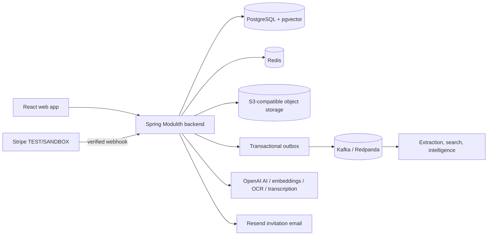

# AssetSphere

AssetSphere is an **event-driven multimodal knowledge and asset intelligence platform**. Teams securely upload documents, images, and videos; preserve version history; retrieve knowledge with lexical, semantic, and hybrid search; generate exact-version intelligence; compare revisions; and ask grounded questions with trusted citations.

> **Your knowledge changes. AssetSphere understands what changed.**

## Live Demo

- [AssetSphere web app](https://assetsphere-mu.vercel.app)
- [Swagger API](https://assetsphere-production.up.railway.app/swagger-ui/index.html)
- [Backend health](https://assetsphere-production.up.railway.app/actuator/health)

The hackathon deployment uses Stripe TEST/SANDBOX mode. No real payment is required.

## Product Highlights

- Isolated workspaces with OWNER/MEMBER authorization, invitations, and audit activity
- PDF, DOCX, TXT, Markdown, CSV, JSON, XLSX, PPTX, PNG, JPEG, WebP, MP4, and WebM assets
- Image OCR and video transcription feeding the same bounded knowledge pipeline as documents
- Explicit version history, exact-version downloads, and Evolution Intelligence
- PostgreSQL full-text search, pgvector semantic retrieval, and deterministic hybrid RRF
- Grounded Ask AssetSphere responses with bounded evidence and trusted citation metadata
- Async extraction and indexing with a transactional outbox, Kafka retries/DLT, and Redis coordination
- FREE/PRO/ENTERPRISE entitlements, authoritative usage accounting, and verified Stripe subscriptions

## Technology

Java 21, Spring Boot, Spring Modulith, Spring Security, PostgreSQL/pgvector, Kafka, Redis, Flyway, Spring AI/OpenAI, React, TypeScript, Vite, TanStack Query, and Tailwind CSS.

Production uses managed PostgreSQL/pgvector, hosted TLS Redis, hosted Kafka/Redpanda over SASL_SSL, private S3-compatible object storage, Stripe, and Resend HTTPS email. MinIO, SMTP, and local Razorpay adapters remain local-development alternatives.

## Backend Engineering / Hackathon Concepts

| Concept | Where | Why |
|---|---|---|
| Idempotency | Upload/version and billing checkout application services | Makes client retries safe without duplicating assets, versions, or payment attempts |
| Transactional outbox | Asset upload/version transactions and outbox publisher | Commits business state and durable event intent atomically |
| Kafka async processing | Extraction, search indexing, semantic indexing, and intelligence listeners | Keeps uploads responsive while expensive processing runs independently |
| Retry and DLT | Topic-specific Kafka retry/dead-letter configuration and operator flow | Bounds transient retries and preserves terminal failures for diagnosis |
| Caching | Redis-backed provider/payment status and application caches | Reduces repeated remote work while retaining authoritative backend state |
| Rate limiting | Redis limiters for uploads, search, RAG, and AI operations | Protects shared infrastructure and provider spend |
| Distributed locking | Redis processing, intelligence, and semantic indexing locks | Prevents concurrent duplicate work for the same asset version |
| Authorization and isolation | Workspace access facades plus workspace-scoped repository predicates | Enforces tenant boundaries before retrieval, storage, or provider invocation |
| Version concurrency | Asset locking/version invariants in append-version transactions | Assigns each logical asset version number exactly once |
| Audit logging | Audit module, security-context auditor, and workspace activity API | Records meaningful workspace changes with an accountable actor |

## Architecture

The backend is a modular monolith: module APIs preserve ownership boundaries while one deployable retains transactional consistency. See [Architecture](docs/ARCHITECTURE.md), [Hackathon Evidence](docs/HACKATHON_EVIDENCE.md), [Deployment](docs/DEPLOYMENT.md), and the [4-Minute Demo Script](docs/DEMO_SCRIPT.md).

## Local Quick Start

1. Start PostgreSQL/pgvector, Redis, Kafka, and MinIO using the repository's local infrastructure.
2. Copy the backend and frontend `.env.example` templates and provide local-only values.
3. Run the backend from `assetsphere-backend/` and frontend from `assetsphere-frontend/`.
4. Register, create a workspace, and follow `docs/DEMO_SCRIPT.md`.

Core configuration includes `DB_URL`, `DB_USERNAME`, `DB_PASSWORD`, Redis, Kafka, JWT, CORS, storage, and `VITE_API_BASE_URL`. AI, OAuth, email, and payments are feature-gated. Never commit secrets or expose backend credentials through `VITE_*` variables.

### Local Payment Adapters

Stripe remains available locally in test mode. The repository also retains `RAZORPAY_LOCAL` adapters for development, demo, and reference integration only; they are rejected by the production profile and are not the deployed payment path. Detailed variables and safety constraints are documented in the backend `.env.example` and `docs/DEPLOYMENT.md`.
