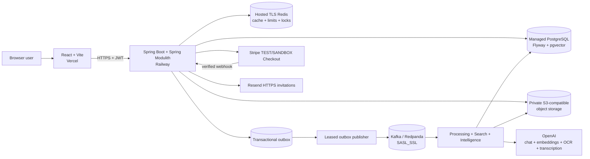
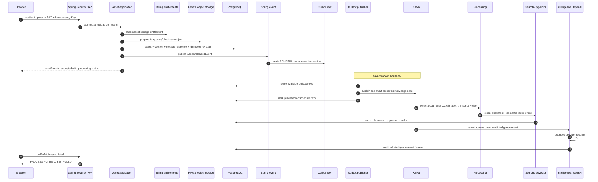

# AssetSphere

AssetSphere is an **event-driven multimodal knowledge and asset intelligence platform** for secure, version-aware team knowledge.

Teams do not merely store files. Knowledge changes across documents, images, videos, and versions, while traditional storage leaves retrieval, change understanding, and governance fragmented. AssetSphere turns those assets into an authorized, searchable knowledge workspace with grounded AI and explicit operational controls.

> **Your knowledge changes. AssetSphere understands what changed.**

## Live Demo

- [AssetSphere web app](https://assetsphere-mu.vercel.app)
- [Swagger API](https://assetsphere-production.up.railway.app/swagger-ui/index.html)
- [Backend health](https://assetsphere-production.up.railway.app/actuator/health)

The deployed hackathon payment path uses **Stripe TEST/SANDBOX**. It requires no real payment.

## What AssetSphere Does

1. A user creates or joins an isolated workspace.
2. The user uploads a document, image, or video; an idempotency key makes retries safe.
3. AssetSphere stores the binary privately, records the asset/version transaction, and writes an outbox event.
4. Kafka consumers extract text, run image OCR or video transcription, build lexical and semantic indexes, and update honest processing states.
5. Workspace members use lexical, semantic, or hybrid search across the latest asset versions.
6. Ask AssetSphere retrieves bounded hybrid evidence and returns a grounded answer with application-authoritative citations.
7. Exact-version Intelligence produces summaries, key points, and tags; Evolution Intelligence compares two selected versions.
8. Owners manage versions, invitations, roles, plan entitlements, usage, and Stripe subscription state.

Verified upload categories are:

- **Documents:** PDF, DOCX, TXT, Markdown, CSV, JSON, XLSX, PPTX
- **Images:** PNG, JPEG/JPG, WebP through OCR
- **Video:** MP4 and WebM through transcription

## Why This Is More Than File Storage

- **Multimodal ingestion:** documents, OCR text, and video transcripts enter one bounded text-processing pipeline.
- **Version-aware knowledge:** immutable `AssetVersion` records preserve history instead of overwriting prior content.
- **Exact-version intelligence:** generation and comparison operate on explicitly authorized versions.
- **Complementary retrieval:** PostgreSQL full-text search and pgvector semantic search are combined through deterministic Reciprocal Rank Fusion (RRF).
- **Grounded answers:** RAG receives bounded evidence, uses deterministic source IDs, filters unknown citations, and avoids the model call when no evidence exists.
- **Workspace isolation:** backend authorization and workspace predicates protect every tenant boundary; frontend role states are not authoritative.
- **SaaS controls:** plan entitlements and usage are enforced before costly operations, while provider webhooks—not browser redirects—control subscription state.
- **Failure-aware processing:** idempotency, an outbox, leases, retries, DLTs, locks, and compensation address different failure boundaries without claiming distributed transactions or exactly-once delivery.

## System Architecture



Production uses private S3-compatible storage, Stripe, and Resend HTTPS. MinIO, SMTP, and `RAZORPAY_LOCAL` are development alternatives, not production dependencies.

## Why a Modular Monolith?

AssetSphere is one deployable Spring Boot application with explicit Spring Modulith business boundaries. This preserves simple operations and cross-module transactional consistency while preventing an unstructured “big ball of mud.” Named module APIs define allowed dependencies and persistence entities remain owned by their modules.

A microservice split would add network contracts, distributed tracing, deployment coordination, and cross-service consistency work before independent scaling is justified. The current design keeps those costs out of the MVP. If one workload later needs independent scaling, its existing API and provider boundaries provide a practical extraction seam—but no claim is made that extraction would be automatic.

## Backend Modules

| Module | Responsibility |
|---|---|
| `auth` | Registration/login, refresh-token rotation, JWT authentication, Google OAuth, and current-user security context |
| `workspace` | Workspaces, memberships, roles, invitations, authorization facade, and workspace-facing activity endpoint |
| `asset` | Asset metadata, immutable versions, uploads/downloads, lifecycle status, idempotency, and version concurrency |
| `storage` | Provider-neutral binary storage facade, checksum-based physical deduplication, reference counts, and compensation |
| `processing` | Extractor selection, bounded text extraction, processing orchestration, and the transactional outbox |
| `search` | Lexical index, semantic chunks/embeddings, pgvector retrieval, hybrid RRF, and bounded Search evidence API |
| `intelligence` | Document intelligence, Evolution, grounded Ask, insights, quizzes, AI model catalog, and result sanitization |
| `billing` | Plans, entitlements, usage accounting, checkout reservation, provider confirmation, and subscription lifecycle |
| `audit` | Durable business activity records and workspace activity queries |
| `common` | Shared exceptions, persistence auditing, security/time contracts, text safety, and web response types |
| `infrastructure` | Kafka, Redis, object-storage, OpenAI, Stripe/local-payment, email, and other external adapters |

Within feature modules, `api` packages expose controllers, DTOs, events, and named interfaces; `application` services orchestrate use cases; `domain` objects enforce lifecycle invariants; and `persistence` remains module-owned. Not every module needs every layer, so the convention is applied where it adds a real boundary rather than as ceremony.

## Architecture and Design Decisions

| Decision / pattern | Problem | AssetSphere implementation | Why chosen | Trade-off / rejected alternative |
|---|---|---|---|---|
| Spring Modulith modular monolith | A single codebase can become tightly coupled | `@ApplicationModule` declarations and named `::api` dependencies | One deployable with enforceable ownership and local transactions | Premature microservices would add operational and consistency overhead |
| Layered responsibilities | Controllers or persistence code can absorb business orchestration | Thin API controllers delegate to application services; domain entities own state transitions | Keeps HTTP, use-case, domain, and persistence concerns understandable | More types than a CRUD-only design |
| Dependency inversion | AI, storage, payment, and messaging providers can change | Interfaces such as `EmbeddingModelPort`, `WorkspaceQuestionAnsweringModel`, `AssetStorage`, `PaymentGateway`, and `OutboxMessagePublisher` have infrastructure adapters | Application code depends on capabilities, not SDKs | Adapter contracts must be maintained explicitly |
| Domain lifecycle invariants | Invalid asset/subscription transitions are easy to persist | `Asset`, `AssetVersion`, `Subscription`, `BillingPayment`, and `OutboxEvent` own transition methods | Centralizes valid state changes | Some persistence updates still use focused JDBC for atomicity/performance |
| Client idempotency + fingerprint | HTTP retries can duplicate uploads or checkouts | Idempotency key, normalized request fingerprint, replay response, and changed-request conflict | Safe retry semantics without treating all same-content uploads as the same logical asset | Clients must retain the key for a logical retry |
| Transactional outbox | Database commit and direct Kafka send can diverge | `@EventListener` plus `Propagation.MANDATORY` writes `OutboxEvent` in the originating transaction | Removes the DB/Kafka dual-write window | Publication remains asynchronous and at-least-once |
| Internal vs external events | Domain/application coordination and broker delivery have different guarantees | Spring application events create transactional outbox rows; the publisher later emits serialized Kafka events | Keeps transaction-local intent separate from external transport | Event schemas and versioning still require discipline |
| Duplicate-tolerant async design | Kafka and publisher retries may redeliver | Stable event IDs, processed-event checks, domain deduplication, locks, and idempotent state transitions | Handles at-least-once behavior honestly | No exactly-once claim; handlers must remain replay-safe |
| Leased outbox claiming | Multiple publisher instances can race | PostgreSQL `FOR UPDATE SKIP LOCKED`, claim owner, timestamp, batch size, and stale-lease recovery | PostgreSQL is already the durable ownership boundary | Polling adds small publication latency |
| Publisher acknowledgement + backoff | A send call can fail after an event is claimed | `KafkaTemplate.send(...).get(...)`; bounded exponential retry and terminal outbox failure state | Marks success only after broker acknowledgement | Waiting bounds throughput but makes state transitions clear |
| Consumer retry and DLT | Provider/transient failures should not loop forever | Topic-specific bounded backoff, non-retryable classification, DLT publication, safe root-cause logging | Separates recoverable attempts from terminal diagnosis | DLT handling is an operational workflow |
| Feature-gated DLT operations | Arbitrary replay is unsafe | OWNER/ADMIN scoped inspection and identity-preserving replay under an explicit config flag | Gives controlled recovery without a parallel database DLQ | Requires an operator decision |
| Pessimistic version lock | Concurrent append requests can choose the same number | `AssetRepository.findForUpdate(...)` locks the asset before `appendVersion()` | Small, database-native critical section | Concurrent appends serialize per asset |
| Redis metadata cache | Asset detail reads repeat stable metadata access | `RedisAssetMetadataCache`; mutation/processing paths evict, including after commit where needed | Improves reads without caching authorization state or entities | Redis failure falls back to database behavior |
| Redis rate limits | Expensive or abuse-prone entry points need bounded demand | Separate upload, semantic-search, and RAG limiters keyed by workspace/user | Protects infrastructure and provider cost | Limits require operational tuning |
| Redis distributed locks | Duplicate consumers can process one version concurrently | Token-owned processing, intelligence, and semantic-index locks | Coordinates work where a database row is not the natural claim boundary | Lock expiry must cover bounded work |
| Checksum storage deduplication | Identical bytes can waste object storage | Workspace-scoped SHA-256 lookup, canonical object key, and reference count | Saves physical storage without conflating logical assets | Deduplication is workspace-scoped and metadata remains separate |
| Temporary-to-canonical storage | Object storage cannot join a PostgreSQL transaction | Prepare temporary object, attach DB reference, materialize canonical key, and compensate on failure | Makes partial failure explicit without pretending to have a distributed transaction | Cleanup is compensating, not atomic across systems |
| Object storage instead of DB BLOBs | Large binaries burden transactional tables | Private provider-neutral `AssetStorage`; metadata and references remain in PostgreSQL | Separates binary throughput from relational queries | Requires lifecycle coordination |
| PostgreSQL full-text search | Exact terms and document language need efficient retrieval | Workspace/latest-version scoped lexical SQL and snippets | Uses an existing durable store and strong exact-match behavior | Lexical search alone misses semantic similarity |
| pgvector semantic retrieval | Meaning-based retrieval needs embedding distance | 1536-dimensional OpenAI embeddings and pgvector cosine-distance operator `<=>` | Avoids another vector database for the MVP | Embedding availability affects semantic results |
| Hybrid RRF | Lexical and semantic scores are not directly comparable | Deterministic reciprocal-rank contributions merged in `SearchApplicationService` | Robust combination without score calibration | Fixed fusion constant is a deliberate simple baseline |
| Retrieval separated from generation | Intelligence should not duplicate search SQL or trust the model for sources | Search owns evidence retrieval; Intelligence consumes bounded Search API DTOs | Clear ownership and independently testable grounding | Requires a stable evidence contract |
| Bounded RAG + trusted citations | Prompts can grow unbounded and models can invent sources | Source/count/character limits, `S1...`, unknown removal, deduplication, trusted metadata, deterministic no-evidence response | Limits data egress and keeps citations application-authoritative | Answers are intentionally constrained by retrieved evidence |
| Exact-version Intelligence/Evolution | Latest-only generation hides historical differences | Explicit version metadata/content facades and two-version comparison | Makes historical reasoning reproducible | Users must choose the versions intentionally |
| Workspace authorization | URL IDs alone cannot establish tenant access | `WorkspaceAccessFacade` before retrieval/provider calls plus workspace-scoped queries | Backend remains authoritative across all clients | Every new use case must include the boundary check |
| JWT + Spring Security | APIs need stateless authenticated identity | JWT filter, BCrypt, refresh rotation, optional Google OAuth, explicit public routes, and CORS policy | Standard security primitives with provider-optional login | Token lifecycle adds client/session complexity |
| Audit trail separate from logs | Operational logs are not a user-facing business history | `AuditService`, `AuditRecord`, and workspace activity query record actions and actors | Durable domain evidence without storing document content in logs | Audit retention needs policy as the system grows |
| Backend-authoritative billing | UI checks can be bypassed and concurrent quota use can overspend | Central plan properties, atomic usage repository operations, `consumeOnce`, and owner-only mutation APIs | Enforces entitlements at expensive boundaries | Correct period/provider event ordering is non-trivial |
| Payment gateway abstraction | Billing core should not contain provider SDK semantics | `PaymentGateway` with Stripe and development-only local adapters | Preserves one billing lifecycle across provider integrations | Provider-specific capabilities still need adapter logic |
| Verified webhook authority | Browser redirects can be forged or abandoned | Signature verification, provider-event idempotency/order state, and transactional confirmation | Subscription state follows the provider, not the browser | Webhook delivery and reconciliation must be observable |
| Immutable Flyway migrations | Shared database history must be reproducible | Versioned V1-V17 migrations applied by Flyway | Deterministic schema evolution | Released migrations are not edited; corrections require a new migration |
| Post-commit cache invalidation | Evicting before rollback can expose unnecessary misses/inconsistency | Transaction synchronization evicts asset metadata after successful commits on relevant paths | Cache follows committed database state | Adds explicit transaction hooks |
| Observability | Async failures need operational signals | Actuator health/readiness/liveness, Micrometer counters in Kafka/DLT/intelligence paths, correlation IDs, and safe identifier logging | Supports health checks and failure diagnosis without logging sensitive content | Full external dashboards/alerts are deployment concerns |
| Feature gates and profile validation | Optional providers should disable cleanly while production stays safe | Conditional adapters, explicit AI/payment/email flags, Stripe validation, and production rejection of local payment mode | Local flexibility without silent production fallback | More configuration must be documented and validated |
| Bounded inputs | Large pages, files, contexts, and model results can exhaust resources | Upload size/MIME checks, extractor limits, query/page bounds, RAG bounds, and output sanitizers | Predictable resource use and data egress | Some large source material is intentionally truncated |

AssetSphere demonstrates Dependency Inversion through concrete provider ports and an Open/Closed direction where new adapters can implement those contracts. It does **not** claim strict adherence to every SOLID principle.

## Reliability by Failure Boundary

1. **Client/API retry:** uploads and checkout requests use idempotency keys. A matching fingerprint replays the prior result; reusing the key for a changed request conflicts.
2. **PostgreSQL-to-Kafka dual-write:** the application publishes an internal Spring event; `OutboxApplicationService` handles it with `Propagation.MANDATORY`, so the outbox row commits or rolls back with the business transaction.
3. **Outbox publication failure:** `OutboxEventClaimRepository` leases rows with `FOR UPDATE SKIP LOCKED`. `OutboxPublisher` waits for the Kafka send acknowledgement, then marks success or schedules bounded exponential retry. Stale `PROCESSING` claims can be reclaimed.
4. **Kafka consumer failure:** listener containers apply bounded retry and non-retryable classification before topic-specific DLT publication. This is separate from outbox publication failure.
5. **Duplicate/concurrent work:** stable event identity, idempotent state checks, processed-event behavior, asset row locking, and token-owned Redis locks cover the relevant handler/version boundaries.
6. **Object-storage consistency:** binaries are prepared under a temporary key, associated with a canonical checksum key, and cleaned up through compensation when database/materialization work fails.

These mechanisms produce a deliberately **at-least-once-safe, duplicate-tolerant** system. They are not a distributed transaction and do not promise exactly-once Kafka semantics.

## Upload-to-Intelligence Flow



The HTTP transaction stops before expensive extraction and generation. The UI reports asynchronous status rather than pretending the asset is immediately searchable or intelligent.

## Search and AI Architecture

Lexical search uses PostgreSQL full-text ranking and workspace/latest-version predicates. Semantic search embeds the query through `EmbeddingModelPort`, validates the configured vector dimension, and uses pgvector `<=>`. Hybrid search asks both retrievers for candidates and merges ranks deterministically through RRF; if the semantic provider is unavailable, the internal hybrid evidence path can retain bounded lexical candidates.

Search owns retrieval. Intelligence never copies Search SQL: `WorkspaceSearchEvidenceRetriever` exposes bounded, entity-free evidence. `WorkspaceRagApplicationService` authorizes first, applies the RAG limiter, assigns `S1`, `S2`, and so on, bounds each source and total context, selects an entitled model, and validates cited IDs against the trusted source map. Empty evidence returns a deterministic response without calling the model.

Format-specific `TextExtractor` implementations handle PDF, DOCX, text, Markdown, CSV, JSON, XLSX, PPTX, images, and video. OCR and transcription are feature-gated and entitlement-aware. Exact-version Intelligence uses selected asset content; Evolution uses two explicitly selected versions. Provider-neutral application ports keep OpenAI/Spring AI details in infrastructure adapters.

## Security and Multi-Tenant Isolation

- Spring Security authenticates JWT requests; Google OAuth is optional and verified in the deployed app.
- `WorkspaceAccessFacade` requires active membership or a permitted role before workspace data access and provider invocation.
- Workspace IDs remain in repository predicates and storage lookups; persistence entities do not cross module APIs.
- Billing mutation controls are owner-managed. MEMBER interfaces are read-only where backend authorization does not permit mutation.
- Storage is private; downloads pass through authorized backend version lookups.
- RAG citations are constructed from trusted Search evidence, not model-supplied metadata.
- Provider inputs are bounded to the authorized feature context. Raw document content, prompts, model responses, binaries, tokens, and secrets are not normal application-log payloads.
- Backend secrets stay in server-side environment/secret stores and never in `VITE_*` variables.

## SaaS Billing Architecture

FREE, PRO, and ENTERPRISE entitlements are centrally configured and returned by the backend. Asset/storage state is cumulative; AI/Ask/Evolution/quiz usage is period-scoped. Atomic repository operations enforce limits, and operation-aware consumption prevents selected retries from double-counting.

The deployed hackathon app uses Stripe TEST/SANDBOX Checkout. Checkout amount/price comes from backend configuration. A success query parameter only informs the UI that Checkout returned; verified Stripe webhooks remain authoritative for activation, period synchronization, provider-event ordering, and cancel-at-period-end state. Scheduled cancellation retains PRO through the current paid period.

`PaymentGateway` also permits `RAZORPAY_LOCAL` adapters in development. The production profile permits Stripe and rejects local Razorpay. This demonstrates provider-boundary extensibility; local Razorpay is not the production payment path.

## Production Deployment

| Layer | Hackathon deployment |
|---|---|
| Frontend | React/Vite on Vercel |
| Backend | Spring Boot modular monolith on Railway |
| Database | Managed PostgreSQL with pgvector |
| Coordination | Hosted TLS Redis |
| Events | Hosted Kafka/Redpanda with SASL_SSL |
| Binary storage | Private S3-compatible object storage |
| AI | OpenAI for configured chat, embeddings, OCR, and transcription capabilities |
| Authentication | JWT plus production Google OAuth |
| Payments | Stripe TEST/SANDBOX |
| Invitation email | Resend HTTPS using the Resend test sender |

See [Deployment](docs/DEPLOYMENT.md) for profile, environment, health, provider, and secret-handling details.

## Local Setup

Prerequisites: Java 21, Maven 3.9+, Node.js, npm, and Docker Desktop.

```bash
cd assetsphere-backend
docker compose up -d postgres redis kafka kafka-ui minio
mvn spring-boot:run -Dspring-boot.run.profiles=dev
```

In another terminal:

```bash
cd assetsphere-frontend
npm install
npm run dev
```

Copy the provided `.env.example` files and use local placeholders—never commit credentials. Backend startup/profile/payment details are in [assetsphere-backend/README.md](assetsphere-backend/README.md).

## Repository Guide

| Path | Contents |
|---|---|
| `assetsphere-backend/` | Java 21 Spring Boot/Spring Modulith API, migrations, adapters, and tests |
| `assetsphere-frontend/` | React/TypeScript authenticated app and public landing experience |
| `docs/` | Architecture, deployment, engineering evidence, and product workflows |
| `infra/` | Local infrastructure support files |

## Hackathon Requirements Mapping

| Requirement | AssetSphere evidence |
|---|---|
| Spring Boot core backend | Modular application modules, REST APIs, Security, JPA/JDBC, Flyway |
| Idempotency | Upload/version and checkout idempotency keys with request fingerprints |
| Transactional outbox | Transaction-bound Spring listeners, leased publisher, Kafka acknowledgement |
| Retry and DLT | Separate publisher retry plus bounded consumer retry and topic-specific DLTs |
| Caching | Redis asset metadata cache with post-commit invalidation |
| Rate limiting | Redis upload, semantic-search, and RAG limiters |
| Distributed locking | Redis processing, intelligence, and semantic-index locks |
| Kafka | Asynchronous extraction, search, semantic indexing, and intelligence workflows |
| Database | PostgreSQL, pgvector, Flyway, JPA/JDBC, locking, and atomic usage updates |
| External services | OpenAI, Stripe, Resend, Google OAuth, and S3-compatible storage behind focused adapters |
| Frontend | Typed React app with honest async, RBAC, billing, search, AI, and version states |
| Deployment and Swagger | Vercel/Railway deployment, public Swagger UI, and Actuator health |

For class-level paths and verification, use the [Hackathon Engineering Evidence](docs/HACKATHON_EVIDENCE.md) fast path.

## Engineering Evidence and Testing

Production smoke verification covered authentication, OWNER/MEMBER authorization, invitations, multimodal processing, versioning, search, grounded Ask, Intelligence/Evolution, and the Stripe TEST subscription flow. A FREE-plan OCR denial exercised Kafka retry through DLT; this is not presented as exhaustive DLT replay verification.

The last verified backend suite completed **313 tests with 0 failures and 0 errors; 6 environment-dependent tests were skipped**. PostgreSQL billing integration tests were separately verified. No new test run is implied by this documentation update.

## Further Documentation

- [Technical Architecture and Design](docs/ARCHITECTURE.md)
- [Hackathon Engineering Evidence](docs/HACKATHON_EVIDENCE.md)
- [Deployment Guide](docs/DEPLOYMENT.md)
