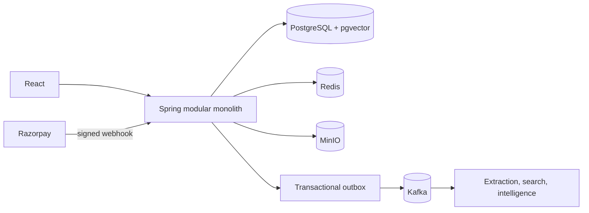

# AssetSphere

AssetSphere is a secure, version-aware knowledge workspace. Teams upload business files, preserve history, generate exact-version intelligence, retrieve knowledge with lexical/semantic/hybrid search, compare revisions, and ask grounded questions with trusted citations.

> **Your knowledge changes. AssetSphere understands what changed.**

## Highlights

- Workspace isolation, members, roles, audit activity, and authorization
- PDF, DOCX, TXT, Markdown, CSV, JSON, XLSX, PPTX, and common image uploads
- Explicit version history, exact-version downloads, and Evolution Intelligence
- Async extraction/indexing with transactional outbox, Kafka retries, and DLTs
- PostgreSQL full-text search, pgvector retrieval, and deterministic hybrid RRF
- Grounded RAG with bounded evidence and trusted citation metadata
- FREE/PRO/ENTERPRISE entitlements, usage accounting, Stripe subscriptions, and verified local-demo upgrades

## Stack

Java 21, Spring Boot, Spring Modulith, Spring Security, PostgreSQL/pgvector, Kafka, Redis, MinIO, Flyway, Spring AI/OpenAI, React, TypeScript, Vite, TanStack Query, Tailwind CSS, and Razorpay Checkout.

## Quick Start

1. Start PostgreSQL/pgvector, Redis, Kafka, and MinIO using `infra/`.
2. Configure the environment variables below.
3. Run the backend from `assetsphere-backend/` and frontend from `assetsphere-frontend/`.
4. Register and follow `docs/DEMO_SCRIPT.md`.

## Configuration

- Core: `DB_URL`, `DB_USERNAME`, `DB_PASSWORD`, `REDIS_HOST`, `KAFKA_BOOTSTRAP_SERVERS`, `ASSETSPHERE_JWT_SECRET`, and `MINIO_*`.
- AI: `ASSETSPHERE_AI_ENABLED`, `OPENAI_API_KEY`, `ASSETSPHERE_AI_EMBEDDING_ENABLED`.
- Payments: select `ASSETSPHERE_PAYMENT_MODE=STRIPE` or `ASSETSPHERE_PAYMENT_MODE=RAZORPAY_LOCAL`.
- Web: `ASSETSPHERE_CORS_ALLOWED_ORIGINS`, `VITE_API_BASE_URL`, and optional `VITE_SOCIAL_*_URL` values.

Never commit secrets. Disabled AI/payment integrations do not require provider credentials.

### Development payment options

- Stripe: `ASSETSPHERE_PAYMENT_MODE=STRIPE`.
- Local Razorpay (preferred demo implementation): `ASSETSPHERE_PAYMENT_MODE=RAZORPAY_LOCAL`, `ASSETSPHERE_LOCAL_RAZORPAY_ENABLED=true`, `LOCAL_RAZORPAY_VARIANT=MY`, and `LOCAL_RAZORPAY_BASE_URL=http://localhost:8082`.
- MY full-demo confirmation: add `ASSETSPHERE_LOCAL_RAZORPAY_POLL_CONFIRMATION_ENABLED=true`. This is DEV/HACKATHON only; production rejects it and verified webhooks remain the production confirmation path.
- MY simulator deterministic failures: UPI `fail@okaxis`, netbanking `BANK_CODE_FAIL`, wallet `WALLET_CODE_FAIL`, card decline `4000000000000002`, and card-expired `4000000000000069`. Other valid values enter the configured probability-based simulator; there is no deterministic success credential in NORMAL mode.
- MY applies one shared API-key limit to orders, payments, vault, and reads. AssetSphere caches provider status, honors `Retry-After`, and defaults provider refresh to 20 seconds. AssetSphere never persists PAN/CVV.
- Local Razorpay (tutor fallback): `ASSETSPHERE_PAYMENT_MODE=RAZORPAY_LOCAL`, `ASSETSPHERE_LOCAL_RAZORPAY_ENABLED=true`, `LOCAL_RAZORPAY_VARIANT=TUTOR`, and `LOCAL_RAZORPAY_BASE_URL=http://localhost:8082`.

Both local variants use `LOCAL_RAZORPAY_KEY_ID`, `LOCAL_RAZORPAY_KEY_SECRET`, and `LOCAL_RAZORPAY_WEBHOOK_SECRET`. The `MY` server creates orders today, but automatic outbound merchant webhook delivery remains pending its final HTTP executor.

## Architecture

See `docs/ARCHITECTURE.md`, `docs/HACKATHON_EVIDENCE.md`, and `docs/DEPLOYMENT.md`.
