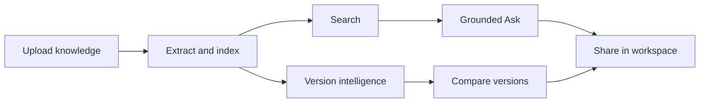
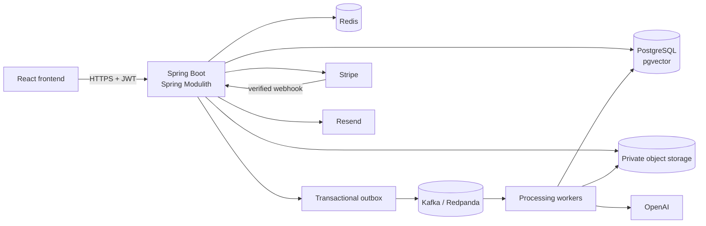

# AssetSphere

AssetSphere is a secure, version-aware knowledge workspace that turns documents, images, and videos into searchable, grounded team intelligence.

> **Your knowledge changes. AssetSphere understands what changed.**

[Live Application](https://assetsphere-mu.vercel.app) · [Swagger / OpenAPI](https://assetsphere-production.up.railway.app/swagger-ui/index.html) · [Architecture](docs/ARCHITECTURE.md) · [Deployment & Local Setup](docs/DEPLOYMENT.md) · [Usage & API Guide](docs/USAGE_AND_API_GUIDE.md)

The public deployment uses Stripe **TEST/SANDBOX** Checkout, so no real payment is required.

## What is AssetSphere?

Traditional file storage preserves files, but it does not understand knowledge spread across formats, semantic relationships between ideas, how information changes between versions, where an answer came from, or who is authorized to see it.

AssetSphere organizes that knowledge inside isolated team workspaces. It extracts text from documents, images, and video; builds lexical and semantic indexes; answers questions from retrieved evidence with trusted citations; and keeps intelligence tied to exact asset versions.

The result is a production-style SaaS application where retrieval, AI, collaboration, version history, billing, and operational reliability share one coherent authorization and data model.

## What You Can Do

| Capability | What it provides |
|---|---|
| Multimodal asset ingestion | Upload PDF, DOCX, TXT, Markdown, CSV, JSON, XLSX, PPTX, PNG, JPEG, WebP, MP4, and WebM assets |
| OCR and transcription | Convert visible image text and spoken video content into searchable knowledge |
| Asynchronous processing | Track honest `UPLOADED`, `QUEUED`, `PROCESSING`, `READY`, `PARTIALLY_PROCESSED`, and `FAILED` states |
| Lexical, semantic, and hybrid search | Combine PostgreSQL full-text retrieval with pgvector similarity and deterministic Reciprocal Rank Fusion |
| Ask AssetSphere | Generate workspace-grounded answers from bounded retrieved evidence |
| Trusted citations | Resolve model-cited `S1...Sn` identifiers through application-owned source metadata |
| Exact-version Intelligence | Generate summaries, key points, tags, insights, and knowledge checks for selected versions |
| Version history and Evolution | Append immutable versions, download any version, and compare how knowledge changed |
| Workspace collaboration | Manage members and invitations through `OWNER`, `ADMIN`, `MEMBER`, `VIEWER`, and `AUDITOR` roles |
| Audit activity | Review durable workspace actions separately from diagnostic logs |
| SaaS plans and billing | Enforce backend-authoritative usage and entitlements with Stripe TEST subscription synchronization |

## Product Journey

1. Create or join an isolated workspace.
2. Upload documents, images, or videos.
3. Let asynchronous processing extract, normalize, and index the content.
4. Retrieve knowledge with lexical, semantic, or hybrid search.
5. Ask grounded questions and inspect trusted citations.
6. Generate exact-version intelligence and knowledge checks.
7. Append versions and compare them with Evolution Intelligence.
8. Collaborate through role-based members, invitations, and activity history.
9. Manage plan usage and subscription state from the billing workspace.



Processing and provider-backed features are asynchronous or quota-controlled where appropriate. The UI presents the persisted state instead of assuming that an accepted upload is immediately searchable.

## Architecture



AssetSphere is a modular monolith with asynchronous event-driven processing. PostgreSQL remains the transactional authority, while Redis, Kafka, object storage, and external providers each serve a focused role. See [Technical Architecture](docs/ARCHITECTURE.md) for module boundaries, sequence diagrams, consistency decisions, and failure handling.

## Why a Modular Monolith?

One Spring Boot deployment keeps operations and transaction boundaries understandable while Spring Modulith verifies explicit business-module dependencies. This avoids introducing network contracts, distributed tracing, and cross-service consistency before independent scaling is justified.

The trade-off is real: modules still share a runtime and database. Extracting one later would require service contracts, data ownership changes, deployment work, and operational tooling; the current boundaries are useful seams, not an automatic microservice guarantee.

## Backend Architecture

| Module | Responsibility |
|---|---|
| `auth` | Registration, login, refresh tokens, JWT authentication, and optional Google OAuth |
| `workspace` | Workspaces, memberships, roles, invitations, authorization, and workspace activity API |
| `asset` | Asset metadata, immutable versions, uploads, downloads, lifecycle status, and idempotency |
| `storage` | Provider-neutral binary storage, checksum deduplication, references, and compensation |
| `processing` | Extractor selection, bounded text extraction, processing orchestration, and outbox records |
| `search` | Lexical indexing, embeddings, pgvector retrieval, hybrid RRF, and bounded evidence APIs |
| `intelligence` | Grounded Ask, exact-version intelligence, Evolution, insights, quizzes, and model selection |
| `billing` | Plans, entitlements, usage, checkout reservation, provider confirmation, and subscriptions |
| `audit` | Durable business activity records and authorized activity queries |

Feature modules expose narrow `api` boundaries. Application services orchestrate use cases, domain objects enforce lifecycle rules, and persistence remains owned by the module that defines the data.

## Engineering Decisions

| Problem | AssetSphere approach | Why it works / trade-off |
|---|---|---|
| Client retries can duplicate writes | `Idempotency-Key` plus normalized request fingerprint | Matching retries replay safely; the same key with changed input conflicts. Clients must retain keys for logical retries. |
| Database commit and Kafka send can diverge | Transactional outbox created in the business transaction | Removes the direct dual-write window; publication remains asynchronous and at-least-once. |
| Publisher instances can race | PostgreSQL claim leases with `FOR UPDATE SKIP LOCKED` | Durable ownership and stale-lease recovery stay with the outbox rows; polling adds bounded latency. |
| Publication can fail after claiming | Broker acknowledgement plus bounded retry/backoff | Success is recorded only after acknowledgement; uncertain failures may still redeliver. |
| Consumers can fail repeatedly | Topic-specific Kafka retry and dead-letter topics | Separates transient attempts from terminal diagnosis; replay remains a controlled operation. |
| Duplicate delivery can repeat work | Stable identities, deduplication, idempotent transitions, and focused locks | Supports duplicate-tolerant processing without claiming exactly-once delivery. |
| Concurrent version uploads can choose the same number | Pessimistic lock on the logical asset | Produces one atomic next version number; concurrent appends serialize per asset. |
| PostgreSQL and object storage cannot share a transaction | Temporary/canonical materialization with compensation | Makes cross-system failure explicit; cleanup is compensating rather than distributed atomicity. |
| Identical bytes waste storage | Workspace-scoped checksum deduplication | Reuses physical content while preserving separate logical assets and metadata. |
| Expensive shared operations need protection | Redis upload, semantic-search, and RAG rate limiters | Bounds infrastructure/provider demand; limits require tuning. |
| Duplicate background work can race | Token-owned Redis locks for processing, intelligence, and semantic indexing | Coordinates version-scoped work; lock expiry must cover bounded execution. |
| Repeated metadata reads add database load | Redis asset metadata snapshots with post-commit invalidation | Keeps authorization and entities out of cache; database fallback remains available. |
| Keyword search misses meaning | PostgreSQL full-text search plus pgvector | Keeps relational tenant filters and vector retrieval together; large-scale vector workloads may later need separate infrastructure. |
| Lexical and semantic scores differ | Reciprocal Rank Fusion | Combines ranks deterministically without score calibration; the fixed fusion constant is a deliberate baseline. |
| Models can invent citations | Retrieval-first bounded RAG with trusted citation validation | Unknown citations are removed and metadata comes only from Search evidence; answers remain constrained by retrieval quality. |
| Intelligence can drift to the latest file | Exact-version content selection | Makes summaries and comparisons reproducible; users must choose versions intentionally. |
| Tenant IDs can be manipulated | Workspace authorization before use cases plus workspace predicates | The backend remains authoritative; every new path must preserve the boundary. |
| Usage checks in the UI can be bypassed | Backend-authoritative plan and atomic usage enforcement | Protects expensive operations under concurrency; period/provider ordering remains complex. |
| Browser checkout return is forgeable | Verified provider webhooks control subscription state | Redirects are presentation only; webhook delivery and reconciliation must remain observable. |
| Payment providers differ | `PaymentGateway` abstraction | Keeps billing core provider-neutral while adapters retain provider-specific capabilities. |
| Schemas evolve over time | Immutable Flyway migrations | Makes environments reproducible; released migrations require forward corrections. |
| Async failures are difficult to diagnose | Actuator, Micrometer, correlation IDs, and safe identifier logging | Provides operational signals without logging document content, prompts, or secrets. |

## Key Runtime Flows

### Upload → Processing

An authorized multipart upload is validated, entitlement-checked, fingerprinted, stored, and persisted with its asset/version and idempotency result. A transaction-bound application event creates an outbox row. The asynchronous publisher sends it to Kafka, where format-specific extraction, lexical indexing, semantic indexing, and intelligence processing update persisted status.

### Search → Grounded Ask

Search owns lexical, semantic, and hybrid retrieval. Ask authorizes the workspace, applies the RAG limiter, retrieves bounded hybrid evidence, assigns deterministic source IDs, calls the selected entitled model once, and validates citations against trusted evidence. Empty evidence returns a deterministic response without a provider call.

### Version → Evolution

Initial upload creates a new asset and Version 1. Only the explicit append-version endpoint advances the same logical asset. Evolution compares two selected, authorized versions using bounded extracted content and preserves both immutable histories.

### Checkout → Subscription Synchronization

The backend reserves an idempotent payment using configured pricing and creates hosted Stripe Checkout. Browser completion never activates a plan. Signed provider events are claimed idempotently, matched to the existing payment/workspace, and used to synchronize subscription identity, periods, status, and cancellation state.

Detailed sequences are available in [Technical Architecture](docs/ARCHITECTURE.md).

## API Overview

| Area | Representative endpoints | Purpose |
|---|---|---|
| Auth | `POST /api/v1/auth/register`, `POST /api/v1/auth/login`, `GET /api/v1/auth/me` | Create users, obtain JWTs, and read current identity |
| Workspace | `GET/POST /api/v1/workspaces`, `GET /api/v1/workspaces/{workspaceId}` | Create and access isolated workspaces |
| Assets | `POST/GET /api/v1/workspaces/{workspaceId}/assets` | Upload and list workspace assets |
| Versions | `POST/GET /assets/{assetId}/versions`, `GET /versions/{versionNumber}/download` | Append, inspect, and download exact versions |
| Search | `GET /api/v1/workspaces/{workspaceId}/search` | Run lexical, semantic, or hybrid retrieval |
| Ask | `POST /api/v1/workspaces/{workspaceId}/ask` | Ask grounded workspace questions with citations |
| Intelligence | Version intelligence, `/compare`, `/insights`, and `/quiz` | Generate bounded exact-version or grounded results |
| Collaboration | `/members` and `/invitations` | Manage workspace access and invitations |
| Audit | `GET /api/v1/workspaces/{workspaceId}/activity` | Read durable business activity |
| Billing | `/billing/plans`, workspace `/billing`, `/checkout`, and `/cancel` | Read entitlements and manage provider-backed subscriptions |
| Operations | Feature-gated `/ops/dlt` routes | Controlled dead-letter inspection and replay |

For complete request bodies, headers, ID chaining, idempotency examples, and expected responses, see the [Usage & API Guide](docs/USAGE_AND_API_GUIDE.md).

`POST /api/v1/billing/webhooks/stripe` is a provider callback, not a normal user API. DLT operations are feature-gated and restricted to authorized `OWNER`/`ADMIN` operators.

## Try AssetSphere

### Using the Web Application

Open the [live application](https://assetsphere-mu.vercel.app), register or sign in, and select a workspace. Upload an asset and wait for its persisted processing state. You can then search, ask grounded questions, generate intelligence, append versions, compare changes, manage members, review activity, and inspect billing usage.

OCR, transcription, provider-backed generation, and some limits depend on the active plan and configured provider availability. The interface shows these states without assuming completion.

### Using Swagger

1. Open [Swagger UI](https://assetsphere-production.up.railway.app/swagger-ui/index.html).
2. Register and then log in.
3. Copy `data.accessToken` and paste the raw JWT into **Authorize**; Swagger adds `Bearer`.
4. Create or select a workspace.
5. Upload a file with an `Idempotency-Key` header.
6. Reuse the returned workspace, asset, and version IDs.
7. Explore Search, Ask, Versions, Intelligence, and Billing.

The [Usage & API Guide](docs/USAGE_AND_API_GUIDE.md) contains the complete sequence and safe request examples.

## Production Deployment

| Layer | Production deployment |
|---|---|
| Frontend | React/Vite on Vercel |
| Backend | Spring Boot modular monolith on Railway |
| Database | Managed PostgreSQL with pgvector |
| Cache and coordination | Hosted Redis with TLS |
| Events | Hosted Kafka/Redpanda with SASL/SSL |
| Binary storage | Private S3-compatible object storage |
| AI | OpenAI chat, embeddings, OCR, and transcription capabilities |
| Payments | Stripe TEST/SANDBOX for the public project deployment |
| Invitation email | Resend HTTPS using the Resend test sender |

See [Deployment](docs/DEPLOYMENT.md) for profiles, required and optional configuration, health endpoints, provider setup, and secret-handling rules.

## Run Locally

Prerequisites are Java 21, Maven 3.9+, Node.js, npm, and Docker Desktop.

```bash
cd assetsphere-backend
docker compose up -d postgres redis kafka kafka-ui minio
mvn spring-boot:run -Dspring-boot.run.profiles=dev
```

In another terminal:

```bash
cd assetsphere-frontend
npm install
npm run dev
```

Copy the provided `.env.example` files and use local values only—never commit credentials. See [Backend Setup](assetsphere-backend/README.md) and [Deployment](docs/DEPLOYMENT.md) for the complete configuration model.

## Testing and Reliability

The last verified backend suite completed **313 tests with 0 failures and 0 errors; 6 environment-dependent tests were skipped**. PostgreSQL-backed billing integration tests were verified separately.

Production smoke checks covered authentication, role boundaries, invitations, multimodal processing, versioning, lexical/semantic/hybrid search, grounded Ask, Intelligence/Evolution, and Stripe TEST subscription synchronization. A FREE-plan OCR denial exercised Kafka retry through its dead-letter path; exhaustive replay behavior is not claimed.

## Documentation

| Document | Purpose |
|---|---|
| [Technical Architecture](docs/ARCHITECTURE.md) | Module ownership, runtime sequences, reliability boundaries, consistency, and trade-offs |
| [Usage & API Guide](docs/USAGE_AND_API_GUIDE.md) | Web application walkthrough, exact Swagger workflow, headers, examples, and operational APIs |
| [Deployment](docs/DEPLOYMENT.md) | Local and production profiles, managed dependencies, health checks, and provider configuration |
| [Engineering Implementation Reference](docs/HACKATHON_EVIDENCE.md) | Source-level map of patterns, representative classes, runtime evidence, and tests |

## Project Context

AssetSphere began as a Spring Boot-focused hackathon project and evolved into a production-style SaaS and backend architecture exercise. The repository emphasizes explicit boundaries, honest failure semantics, grounded AI, and practical operational trade-offs over feature-only implementation.
