# AssetSphere: Business Workflows Specification

---

## 1. Introduction

### 1.1 Purpose of Business Workflows
The purpose of this document is to specify and define the complete, end-to-end business workflows for the AssetSphere platform. It translates the high-level goals outlined in the Product Requirements Document (PRD) into precise, step-by-step human and system interactions. By formalizing these flows prior to implementation, we establish a shared operational vocabulary across product managers, user experience designers, and engineering teams, ensuring the platform's behavior strictly matches the business philosophy and enterprise rules.

### 1.2 Scope
This specification describes the behavior of all core capabilities in the AssetSphere platform, including identity management, multi-tenant workspace collaboration, asset management, asynchronous processing pipelines, intelligence capabilities (AI), notifications, and compliance auditing. 

This is a **purely business-focused specification**. Technical mechanisms, data storage schemas, API route signatures, and infrastructure stacks are strictly out of scope. System actions are described conceptually in terms of business capabilities (e.g., "The storage system persists the file" rather than "The application makes an S3 multipart upload call").

### 1.3 Actors
Workflows inside AssetSphere are initiated or executed by a set of well-defined human and automated actors. These actors interact within boundaries established by Role-Based Access Control (RBAC) and workspace partitioning:

*   **Human Actors:**
    *   **Organization Admin (Org Admin):** High-level platform owner with global oversight of all workspaces, users, licensing, and compliance records.
    *   **Workspace Admin (WS Admin):** Administrator of a specific workspace, responsible for members, invitations, roles, and workspace-level assets.
    *   **Workspace Member (WS Member):** Core collaborative user who can create, upload, version, annotate, and retrieve assets.
    *   **Viewer:** Restricted user with read-only access to specific workspaces to view and download assets without edit or administrative privileges.
    *   **Auditor:** Specialized security role with platform-wide read-only access to audit trails, activity timelines, and compliance reporting.
*   **System Actors:**
    *   **Processing Engine:** The automated, asynchronous engine responsible for executing lifecycle pipelines, security scans, text extraction, indexing, and state coordination.
    *   **AI Service (Intelligence Layer):** The background service responsible for OCR, document summarization, embedding generation, semantic analysis, and automated metadata enhancement.

---

## 2. List of Actors and Matrix of Capabilities

| Actor / Capability | Platform Governance | Workspace Admin | Asset Upload & Versioning | Standard Search & Download | Semantic & AI Features | Compliance Auditing |
| :--- | :---: | :---: | :---: | :---: | :---: | :---: |
| **Org Admin** | **Yes** | **Yes** (All) | **Yes** | **Yes** | **Yes** | **Yes** |
| **Workspace Admin**| No | **Yes** (Own) | **Yes** | **Yes** | **Yes** | **Yes** (Own) |
| **Workspace Member**| No | No | **Yes** | **Yes** | **Yes** | No |
| **Viewer** | No | No | No | **Yes** | **Yes** | No |
| **Auditor** | No | No | No | **Yes** (Read Only)| No | **Yes** (All) |

---

## 3. End-to-End Workflows

### 3.1 User Registration / Login

#### Purpose
To securely onboard a new user to the enterprise platform or verify an existing user's identity to issue an active session.

#### Trigger
A human actor navigates to the platform's access page and enters credentials or selects registration.

#### Preconditions
*   The organization's platform must be active and accessible.
*   For registration, the user must possess a valid corporate email.

#### Mermaid Flowchart
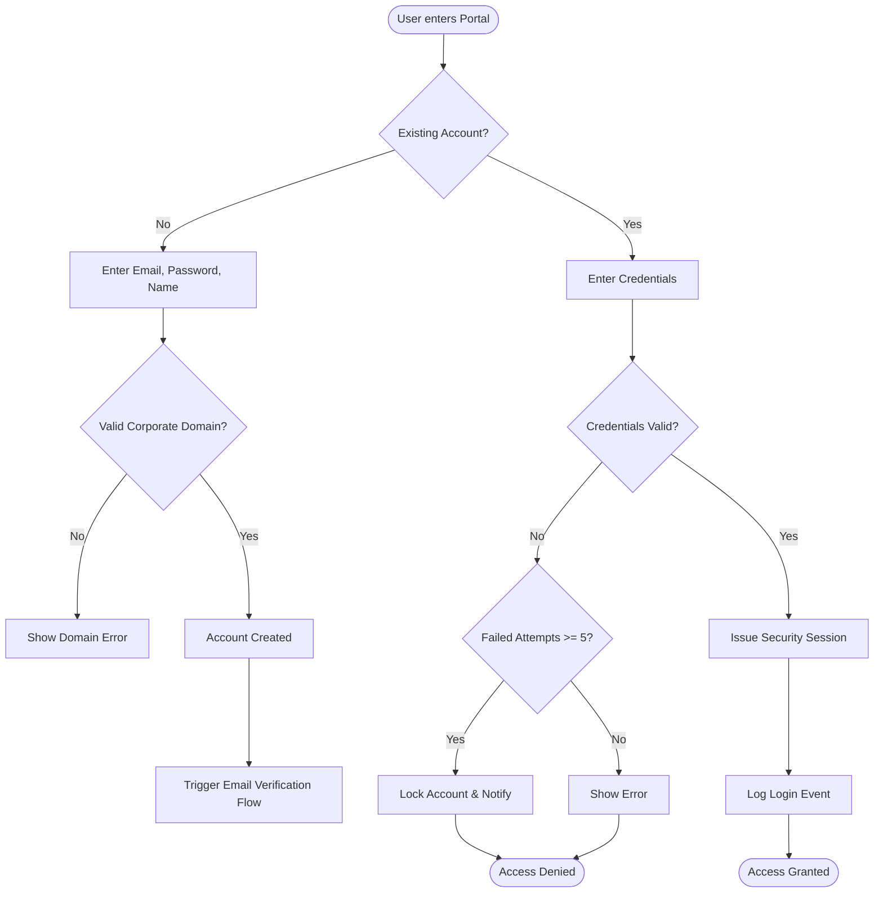

#### Main Flow (Login)
1.  User enters credentials (corporate email and password).
2.  System verifies credentials.
3.  System checks if account is locked or disabled.
4.  System starts a secure, tracked user session.
5.  System generates a secure audit entry of the successful login.
6.  User is redirected to their default Dashboard.

#### Alternate Flows
*   **Unverified Email Registration:** A user registers but has not verified their corporate email. The system restricts login capabilities, redirecting them to a verification prompt until the email link is completed.

#### Failure Cases
*   **Account Locked:** User makes 5 consecutive incorrect attempts. The system updates the account state to "Locked", triggers an alert notification, and blocks further attempts for 30 minutes.
*   **Deactivated Account:** An administrator deactivates the user. Access is immediately denied with an administrative block message.

#### Business Rules
*   Every login attempt, whether successful or failed, must create an immutable audit record containing IP metadata.
*   Password complexity must enforce corporate compliance standards (minimum length, mixed characters).

#### Final State
*   User is authenticated with an active session, or access is securely rejected.

---

### 3.2 Create Workspace

#### Purpose
To establish a secure, logically isolated multi-tenant container for managing grouped assets, users, and activities.

#### Trigger
An Org Admin or authorized user clicks "Create Workspace" from their dashboard.

#### Preconditions
*   User must hold the Org Admin role or have specific permission to create workspaces.
*   Platform must have available capacity.

#### Mermaid Sequence Diagram
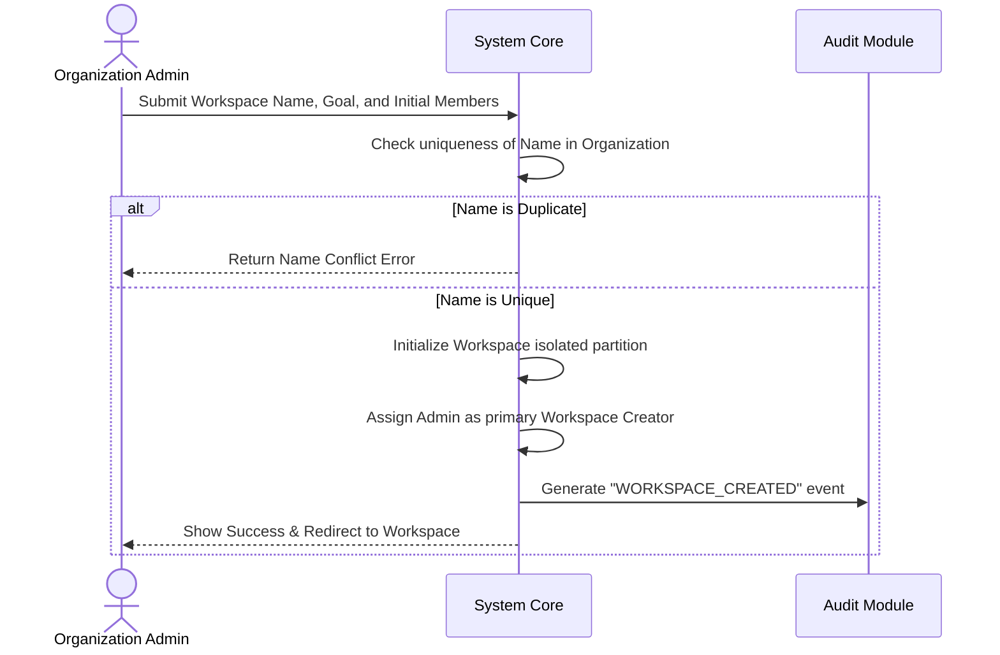

#### Main Flow
1.  Admin initiates workspace creation.
2.  Admin fills out Workspace Name, Description, and tags.
3.  System validates that the workspace name is unique within the organization.
4.  System initializes the workspace environment.
5.  System registers the creator as the default Workspace Admin.
6.  System records a `WORKSPACE_CREATED` event in the central audit log.
7.  Admin is redirected to the workspace's landing screen.

#### Alternate Flows
*   **Pre-populated Template:** Admin selects an "HR Template" or "Engineering Template". The system pre-builds a folder taxonomy and default permission structures.

#### Failure Cases
*   **Name Conflict:** A workspace with the exact name already exists. Creation is halted, and the user is requested to provide a unique identifier.

#### Business Rules
*   Every workspace must have at least one active Workspace Admin assigned.
*   Workspace name cannot be empty and must match organizational conventions (3 to 50 characters).

#### Final State
*   A new, empty workspace partition is created, and the audit log records the configuration.

---

### 3.3 Invite Member

#### Purpose
To securely invite a new or existing platform user to collaborate within a specific workspace boundary.

#### Trigger
A Workspace Admin clicks "Invite Member" inside the workspace configuration dashboard.

#### Preconditions
*   The workspace must be active (not archived).
*   The inviting actor must hold the Workspace Admin or Org Admin role.

#### Main Flow
1.  Workspace Admin inputs the email of the target user and selects a workspace role (e.g., WS Member, Viewer).
2.  System verifies if the email corresponds to an existing system user.
3.  System checks if the target user is already a member of the workspace.
4.  System generates a secure, tokenized workspace invitation link.
5.  System sends an invitation notification containing the secure link to the invitee's email.
6.  System registers a pending invitation state in the workspace membership records.
7.  System logs the event `INVITATION_SENT` in the audit logs.

#### Alternate Flows
*   **New User Invitation:** The invitee does not have an account. The system flags the invitation as "Pending Registration". Upon registration, the user is immediately routed to the invitation acceptance flow.

#### Failure Cases
*   **Existing Membership:** The target user is already a member. The system halts the action and displays "User is already a member of this workspace."
*   **Invalid Domain:** The input email does not match authorized corporate domains. The system rejects the invite.

#### Business Rules
*   All invitation links must automatically expire after exactly 7 calendar days.
*   A pending invitation can be canceled by any Workspace Admin at any time prior to acceptance.

#### Final State
*   A pending invitation record is generated, and a secure invitation notification is sent out.

---

### 3.4 Accept Invitation

#### Purpose
To complete the secure onboarding of an invited user into a workspace.

#### Trigger
An invited user clicks the verification link in their invitation notification.

#### Preconditions
*   An invitation must exist in "Pending" status and not be expired.
*   The invitee must be logged in with the email address that matches the invitation.

#### Mermaid Sequence Diagram
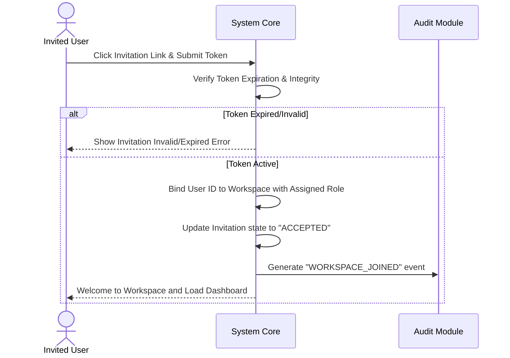

#### Main Flow
1.  User clicks the invitation link.
2.  System validates the security token and checks expiration.
3.  System verifies that the logged-in user matches the target invitation email.
4.  System binds the user to the workspace with the pre-assigned role.
5.  System updates the invitation status to `ACCEPTED`.
6.  System registers a `MEMBER_JOINED` audit event.
7.  User is shown a confirmation screen and routed into the workspace.

#### Alternate Flows
*   **Email Mismatch Account Swap:** If the logged-in user email doesn't match, the system prompts them to log out and log in with the correct account corresponding to the invitation.

#### Failure Cases
*   **Expired Token:** The user attempts to accept an expired invitation. The system displays a failure screen and prompts them to request a new invitation from the Workspace Admin.

#### Business Rules
*   An invitation token can only be accepted once. After acceptance, the token must be invalidated immediately.

#### Final State
*   The user's account is active within the workspace membership roster.

---

### 3.5 Upload Asset

#### Purpose
To securely upload and initiate processing of a new enterprise digital asset within a workspace.

#### Trigger
A Workspace Member or Admin drags and drops a file or selects a file for upload.

#### Preconditions
*   User must hold "Member" or "Admin" role in the current workspace.
*   The workspace must be active (not archived).
*   The file must conform to size and type constraints.

#### Mermaid Flowchart
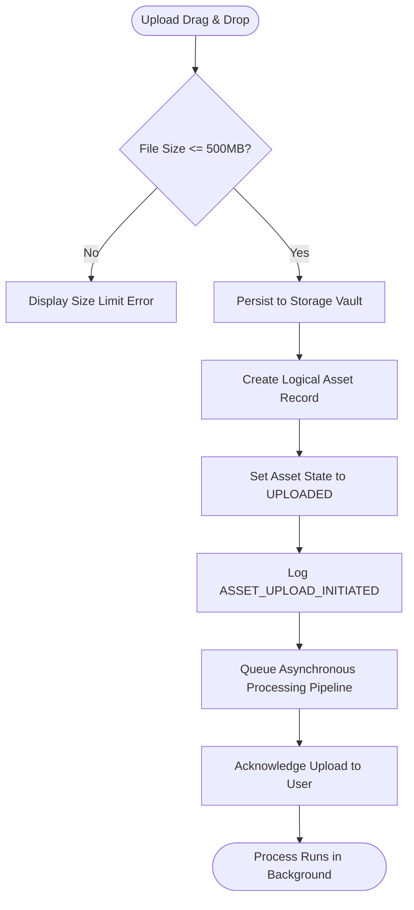

#### Main Flow
1.  User initiates upload of a file and inputs optional initial metadata.
2.  System checks user authorization and validates file size constraints.
3.  System uploads file to the S3-compatible enterprise storage vault.
4.  System computes a secure SHA-256 checksum of the incoming stream.
5.  System creates a logical asset record with version 1, mapping it to the workspace.
6.  System sets the initial asset state to `UPLOADED`.
7.  System registers an `ASSET_UPLOAD` event in the audit log.
8.  System queues the asynchronous processing pipeline.
9.  System returns a rapid success acknowledgment to the user, who can monitor progress.

#### Alternate Flows
*   **Pre-Categorization:** The user selects a document type (e.g., "Invoice", "Contract") during upload. The system binds this schema to the asset to guide metadata extraction.

#### Failure Cases
*   **File Format Denied:** The uploaded file matches a banned executable extension. The system immediately rejects the file and alerts the user.

#### Business Rules
*   All assets must belong to a single workspace.
*   Every successful upload must immediately create a Version 1 record.

#### Final State
*   The file is safely stored, the asset state is set to `UPLOADED`, and the processing pipeline is queued.

---

### 3.6 Upload Duplicate Asset

#### Purpose
To manage uploads of files that contain identical content to existing files in the platform while optimizing system resources.

#### Trigger
A user uploads a file that matches an existing asset's SHA-256 checksum.

#### Preconditions
*   User has upload permissions in the workspace.
*   The file has been uploaded, and the SHA-256 checksum has been calculated.

#### Main Flow
1.  User uploads a file.
2.  System computes the SHA-256 checksum of the incoming stream.
3.  System searches the organization-wide data registry for a matching checksum.
4.  A match is found, indicating a duplicate.
5.  System checks business rules:
    *   If the existing asset is in the **same workspace** and the user has access, the system prompts: "An identical file already exists. Do you want to link to it or create a unique reference?"
    *   If the user opts to create a unique reference (or if the match is in a **different workspace**), the system registers a new logical asset.
6.  Instead of storing a new physical file, the new asset's version point points directly to the existing physical storage path.
7.  System records a `DUPLICATE_UPLOAD_OPTIMIZED` event in the audit log.
8.  System fast-tracks the pipeline since physical storage operations are skipped.

#### Alternate Flows
*   **Duplicate and Re-route:** If matching is exact and located in the same path within the same workspace, the system rejects the duplicate upload, informing the user that the file is already active at that location.

#### Failure Cases
*   **Underlying File Missing:** The registry points to a matching checksum, but the physical file is missing due to a recovery event. The system falls back to a standard physical upload flow.

#### Business Rules
*   Checksum equality must never prevent the creation of multiple logical assets when business boundaries (like separate workspaces) require isolation.
*   Storage optimization must be transparent; users must see distinct assets in their workspace.

#### Final State
*   A new logical asset is created, but no duplicate physical storage space is consumed.

---

### 3.7 Upload New Version

#### Purpose
To upload an updated file for an existing asset, ensuring complete tracking of modifications while preserving historical files.

#### Trigger
A user clicks "Upload New Version" on an active asset details page.

#### Preconditions
*   The asset must be in `READY` state.
*   User must hold Member or Admin roles in the workspace.
*   The file extension should match the original file type to prevent corrupting file histories.

#### Mermaid Sequence Diagram
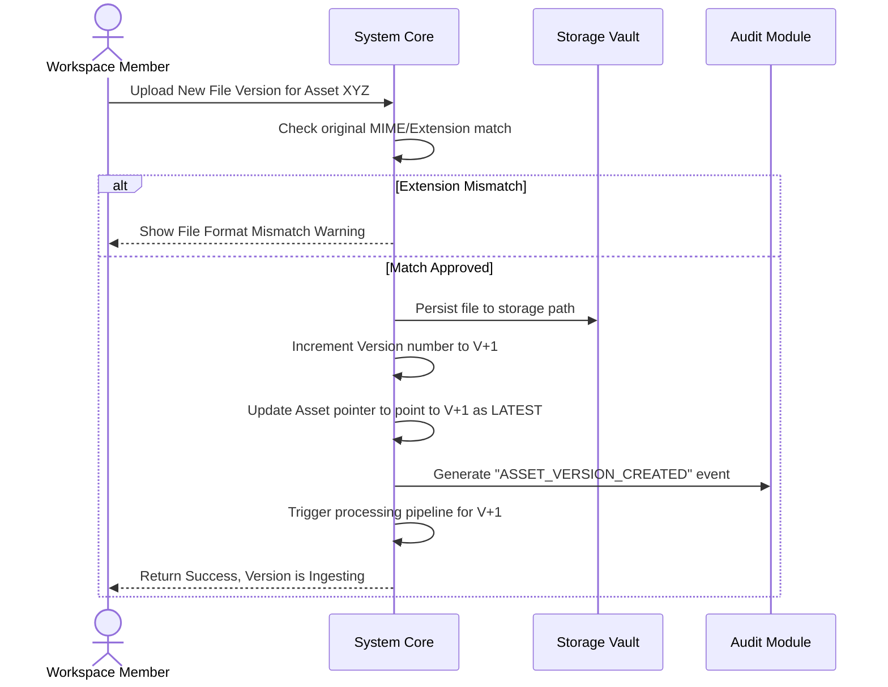

#### Main Flow
1.  User uploads a file as a new version.
2.  System validates file format compatibility.
3.  System persists the file to a unique version path in the storage vault.
4.  System retrieves the current version number and increments it (e.g., V1 to V2).
5.  System marks the new version as the primary "LATEST" state.
6.  The previous version is marked as "HISTORICAL" and becomes read-only.
7.  System creates an audit log entry for `ASSET_VERSION_CREATED`.
8.  Asynchronous processing pipeline is triggered for the new version.

#### Alternate Flows
*   **Major/Minor Tagging:** The user flags the version as a "Major Version" (e.g., V2.0) or "Minor Version" (e.g., V1.1) to align with enterprise change management structures.

#### Failure Cases
*   **Simultaneous Modification Conflict:** Two users attempt to upload a new version at the exact same moment. The second upload is rejected because the target version state has changed, prompting the user to pull the latest version first.

#### Business Rules
*   Historical versions must remain completely immutable.
*   All past versions of an asset must be preserved; uploading a new version must never delete or overwrite past versions.

#### Final State
*   An incremented, active version is registered on the asset, and the file is queued for processing.

---

### 3.8 Edit Metadata

#### Purpose
To modify the descriptive, custom, or system classification attributes of an asset without altering its file content.

#### Trigger
A user modifies tags, classification, or metadata fields on the asset view page and saves.

#### Preconditions
*   User must have "Member" or "Admin" roles in the workspace.
*   The asset must be active (not archived or soft-deleted).

#### Main Flow
1.  User enters edit mode on an asset's metadata profile.
2.  User updates fields (e.g., Description, Project Owner, Expiration Date, Custom Tags).
3.  System runs schema validation on the input metadata fields.
4.  System updates the logical metadata registry for the asset.
5.  System registers an `ASSET_METADATA_UPDATED` event in the audit trail.
6.  System triggers a lightweight "Indexing Update" processing stage to refresh search indexing.
7.  System displays confirmation of the updated metadata.

#### Alternate Flows
*   **AI Auto-Metadata Validation:** The user reviews AI-extracted metadata fields (e.g., suggested tags), approves them, and saves. They are transformed from "Suggested" to "Confirmed" state.

#### Failure Cases
*   **Schema Violation:** User enters a string into a date field. The system halts saving, highlighting the error and requiring correct formatting.

#### Business Rules
*   Metadata changes do not change the asset file version.
*   Every change in metadata must generate an audit trail showing previous values and new values.

#### Final State
*   The asset's metadata record is modified, and the search indices are updated.

---

### 3.9 Download Latest Version

#### Purpose
To retrieve the active, latest approved file version of a specific asset from the secure storage vault.

#### Trigger
A user clicks "Download" on an asset card or asset details view.

#### Preconditions
*   User must have at least "Viewer" role in the parent workspace.
*   The asset must be in `READY` or `ARCHIVED` state.

#### Mermaid Sequence Diagram
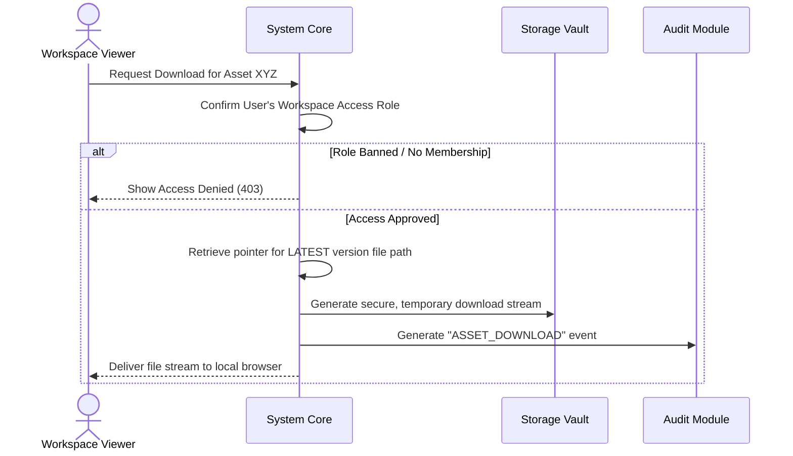

#### Main Flow
1.  User requests download.
2.  System validates that the user is actively authorized to view the workspace.
3.  System locates the logical metadata for the asset and finds the file pointer for the "Latest" version.
4.  System retrieves the file stream from the secure storage vault.
5.  System records an `ASSET_DOWNLOAD` event in the audit logs, documenting the specific version downloaded.
6.  System delivers the file stream to the user's browser.

#### Alternate Flows
*   **Bulk Download:** User selects multiple assets. The system creates a temporary, on-the-fly zip container, streams files into it, logs individual download records, and delivers the zip.

#### Failure Cases
*   **Asset In Processing:** The asset is in `PROCESSING` state and has no ready versions. Download is blocked, and the user is requested to wait for processing to finish.

#### Business Rules
*   Downloads must always create a persistent audit trail. No user can download an asset anonymously.

#### Final State
*   The latest file version is safely transferred to the client, and the action is audited.

---

### 3.10 Download Old Version

#### Purpose
To retrieve a specific, older version of an asset for comparative, historical, or recovery purposes.

#### Trigger
A user navigates to the "Version History" tab of an asset and clicks "Download" next to an older version (e.g., Version 2 of 5).

#### Preconditions
*   User has at least "Viewer" access to the workspace.
*   The requested version must exist in the database history.

#### Main Flow
1.  User opens version history.
2.  User requests download of V2.
3.  System checks workspace permissions.
4.  System fetches the specific storage pointer associated with Version 2 of that asset.
5.  System generates a secure stream from the storage vault.
6.  System logs an `ASSET_HISTORICAL_DOWNLOAD` event in the audit log.
7.  System delivers the V2 file stream to the browser.

#### Alternate Flows
*   **Restore to Latest:** Admin wants V2 to become the current working version. Rather than re-uploading, they select "Promote Version". The system reads V2 content and writes it as V6 (the new Latest), keeping the timeline clean.

#### Failure Cases
*   **Version Not Found:** Due to a mismatch, the requested version records exist, but the physical file is missing. System cancels download and alerts system administrators.

#### Business Rules
*   All historical versions must be permanently preserved unless an explicit compliance policy dictates purging.

#### Final State
*   The historical file version is delivered, and the event is written to the audit history.

---

### 3.11 Delete Asset (Soft Delete)

#### Purpose
To safely remove an asset from active workspace views while preserving it in a trash state to prevent accidental loss.

#### Trigger
A Workspace Member or Admin clicks "Delete Asset".

#### Preconditions
*   User must hold Member or Admin roles in the workspace.
*   The asset must not already be in a deleted state.

#### Mermaid Flowchart
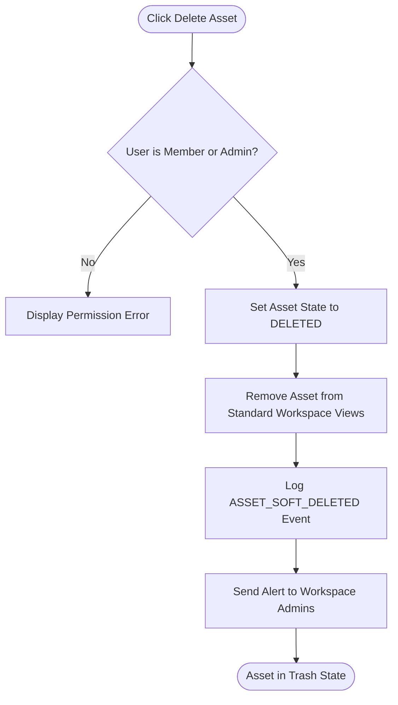

#### Main Flow
1.  User clicks Delete.
2.  System verifies that the user holds correct permissions.
3.  System updates the logical state of the asset to `DELETED`.
4.  System moves the asset to the workspace's "Trash" container, hiding it from standard directories and search results.
5.  System generates an audit trail entry for `ASSET_SOFT_DELETED`.
6.  System updates the asset's active timeline metadata.

#### Alternate Flows
*   **Auto-Expiry Soft Delete:** An automated compliance policy reaches its expiration threshold for an asset. The system automatically shifts the asset to the `DELETED` state and logs `SYSTEM_AUTO_DELETE`.

#### Failure Cases
*   **Locked Asset:** The asset is currently checked out or locked for processing. The system blocks deletion and displays "Cannot delete an asset while it is actively being processed or locked."

#### Business Rules
*   Soft-deleted assets must remain in the Workspace Trash for a default compliance retention period (typically 30 days) before becoming eligible for permanent deletion.

#### Final State
*   The asset is hidden from general users, located in the trash, and logged as soft-deleted.

---

### 3.12 Restore Asset

#### Purpose
To recover a soft-deleted asset from the workspace trash, returning it to active workspace status with full history intact.

#### Trigger
A Workspace Admin or Member selects a soft-deleted asset in the Trash tab and clicks "Restore".

#### Preconditions
*   The asset must currently be in the `DELETED` state.
*   The user must hold the necessary restore permissions in the workspace.

#### Main Flow
1.  User navigates to Workspace Trash.
2.  User selects the asset and clicks Restore.
3.  System checks workspace access permissions.
4.  System verifies if the parent workspace itself is active.
5.  System restores the asset's state to `READY` (or its state prior to deletion).
6.  System returns the asset to its original workspace directories.
7.  System logs the event `ASSET_RESTORED` in the audit registry.
8.  The restored asset becomes searchable and downloadable once again.

#### Alternate Flows
*   **Restore to Alternate Path:** If the original folder path was deleted while the asset was in the trash, the system restores the asset to the root directory of the workspace.

#### Failure Cases
*   **Workspace Archived:** The parent workspace has been archived. Restoration is blocked until the Workspace Admin reactivates the workspace.

#### Business Rules
*   Restoring an asset must preserve its entire original version history, metadata, and past audit records.

#### Final State
*   The asset is restored to active status, and the recovery is recorded in the logs.

---

### 3.13 Permanent Delete

#### Purpose
To completely and permanently purge an asset and all of its versions from the physical storage vaults and system registries.

#### Trigger
A Workspace Admin clicks "Permanently Delete" from the Trash dashboard, or an automated compliance schedule runs.

#### Preconditions
*   The asset must be in the `DELETED` state.
*   User must hold the Workspace Admin or Org Admin role.

#### Mermaid Sequence Diagram
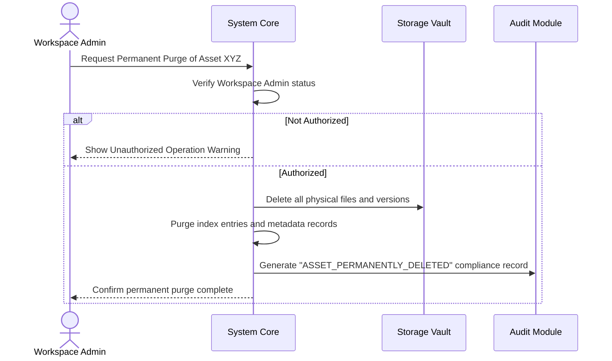

#### Main Flow
1.  Admin requests permanent deletion.
2.  System verifies that the user holds Workspace Admin or Org Admin roles.
3.  System locates all physical file paths across all historical versions of the asset.
4.  System commands the storage vault to delete all physical versions of the file.
5.  System removes the asset's text indexes, embeddings, metadata, and database records.
6.  System records an immutable `ASSET_PERMANENT_PURGE` event in the audit trail (the log retains metadata of the action, but file data is deleted).
7.  System displays confirmation of the permanent purge.

#### Alternate Flows
*   **Compliance Auto-Purge:** A system daemon identifies assets that have been in the trash for longer than 30 days and automatically initiates this workflow.

#### Failure Cases
*   **Storage Access Failure:** The physical storage subsystem is temporarily unreachable. The system halts the database purge to prevent orphan storage files and queues the task for retry.

#### Business Rules
*   Permanent deletion is irreversible. Once executed, data cannot be recovered.
*   The audit log must preserve the historical record of the asset's existence and purge action for compliance, but the file content is destroyed.

#### Final State
*   All physical and logical records of the asset are purged, and the audit trail preserves the purge history.

---

### 3.14 Search by Metadata

#### Purpose
To find assets in a workspace by filtering, sorting, and matching specific structural metadata parameters.

#### Trigger
A user enters search terms or applies metadata filters in the workspace search bar.

#### Preconditions
*   User has at least "Viewer" access to the workspace.
*   Search indexes must be active.

#### Main Flow
1.  User selects metadata filters (e.g., File Type = PDF, Created Date = Last 7 Days, Tag = "Contract").
2.  User submits the query.
3.  System queries the search index, restricting searches to the user's active workspaces.
4.  System retrieves matching asset records.
5.  System filters out any assets in `DELETED` state.
6.  System returns a list of matching assets, complete with summaries and highlighted metadata match fields.

#### Alternate Flows
*   **Saved Searches:** User saves their search filters (e.g., "Active Marketing Assets"). The system stores this query profile for rapid execution in the future.

#### Failure Cases
*   **Indexing Lag:** A newly uploaded asset has not finished indexing. The search will not return it until the pipeline achieves `READY` state.

#### Business Rules
*   Search results must strictly enforce workspace boundaries. A user must never see search results from workspaces they do not belong to.

#### Final State
*   Matching assets are displayed to the user within their authorized security scope.

---

### 3.15 Search by Document Content

#### Purpose
To discover assets by scanning the extracted textual content of files for specific keywords and phrases.

#### Trigger
A user enters a keyword query (e.g., "force majeure clause") in the search interface.

#### Preconditions
*   Text extraction pipeline must have completed successfully for the target assets.
*   User has authorized access to the search context.

#### Mermaid Flowchart
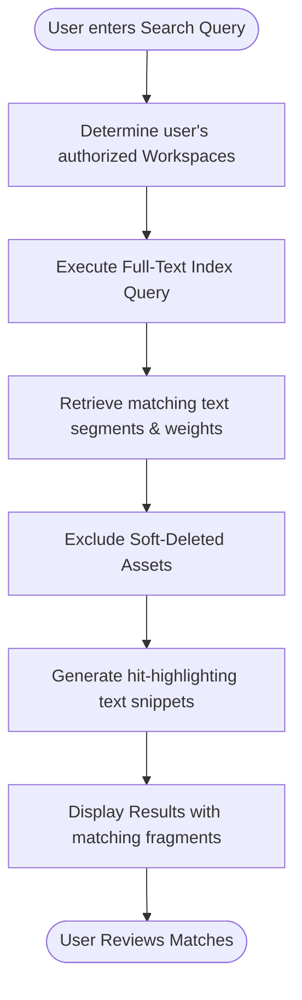

#### Main Flow
1.  User enters a keyword search phrase.
2.  System determines user's active workspaces.
3.  System searches the full-text search index for matches within the extracted file content.
4.  System scores and ranks matching files based on relevance algorithms.
5.  System generates "hit-highlighting" text snippets around matching terms.
6.  System presents results to the user with matched text snippets and direct links to the assets.

#### Alternate Flows
*   **Wildcard/Phrase Matching:** User utilizes operators (e.g., `"confidentiality agreement" AND "2026"`) to perform advanced proximity searches.

#### Failure Cases
*   **Unindexed Documents:** Image-based PDFs that did not run through OCR cannot be discovered via text search. The system alerts the user if unindexed assets are in their workspace.

#### Business Rules
*   Full-text index matches must only search within the specific workspaces authorized for the logged-in user.

#### Final State
*   A ranked list of documents with contextual matches is returned to the user.

---

### 3.16 AI Semantic Search

#### Purpose
To find assets based on conceptual meaning, intent, and context rather than exact keyword matches.

#### Trigger
A user toggles "Semantic Search" and enters a natural language query (e.g., "What are our guidelines for workplace safety?").

#### Preconditions
*   The Intelligence Layer (AI) must be active and enabled.
*   The target assets must have vector embeddings generated and stored in the index.

#### Main Flow
1.  User enters a semantic natural language query.
2.  System routes the query to the Intelligence Layer.
3.  Intelligence Layer converts the search query into a vector embedding.
4.  System executes a similarity search within the vector index.
5.  Search is constrained strictly to the workspaces where the user has active membership.
6.  System returns assets ranked by their conceptual proximity to the search query.
7.  System presents results to the user with relevance percentage indicators.

#### Alternate Flows
*   **Fallback to Keyword Search:** If the AI Service is temporarily offline, the system automatically falls back to standard text search and informs the user: "Semantic search is unavailable; executing keyword search instead."

#### Failure Cases
*   **AI Service Offline:** The AI Service fails to respond within the 5-second connection timeout. The system automatically shifts to the fallback workflow.

#### Business Rules
*   Semantic search must strictly respect workspace boundaries.
*   AI operations must fail gracefully without compromising search availability.

#### Final State
*   A ranked list of conceptually relevant files is returned within the user's workspace context.

---

### 3.17 AI Summary

#### Purpose
To automatically generate a clear, concise executive summary of a document's content, accelerating comprehension and discovery.

#### Trigger
A user navigates to an asset details page and clicks "Generate AI Summary", or an automated workspace ingestion rule runs.

#### Preconditions
*   The asset text content must be extracted and indexed.
*   The Intelligence Layer must be active.
*   The user must hold at least "Viewer" access.

#### Mermaid Sequence Diagram
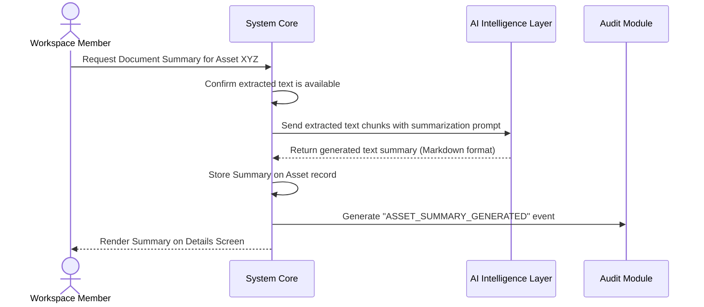

#### Main Flow
1.  User clicks "Generate AI Summary".
2.  System retrieves the extracted text content of the asset.
3.  System checks if the text size exceeds the context window. If so, it aggregates summaries of the document chunks.
4.  System sends the text to the AI Service with a specialized summarization prompt.
5.  AI Service returns the structured markdown summary.
6.  System saves the summary to the asset's metadata profile.
7.  System generates an `ASSET_SUMMARY_CREATED` event in the audit trail.
8.  System displays the summary prominently on the asset page.

#### Alternate Flows
*   **Auto-summarize on Ingestion:** A workspace-level policy dictates that all uploaded documents are automatically summarized during the ingestion pipeline.

#### Failure Cases
*   **Empty Document:** The document has no extractable text. The summarization process is aborted, and the user is notified that the document has no content to summarize.

#### Business Rules
*   Summaries generated by the AI must be labeled as "AI-Generated" to ensure clear distinction from user-edited content.

#### Final State
*   A concise, persistent summary is appended to the asset and displayed to authorized workspace users.

---

### 3.18 OCR Processing

#### Purpose
To convert scanned documents, images, or image-only PDFs into readable, indexable, and searchable text files.

#### Trigger
An image file (PNG, JPG) or an image-only PDF is uploaded to the workspace and enters the processing pipeline.

#### Preconditions
*   The processing pipeline is running.
*   The Intelligence Layer OCR feature is enabled.

#### Main Flow
1.  The Processing Engine identifies the file format as an image or scanned document.
2.  Processing Engine sends the binary stream of the file to the OCR processing module of the AI Service.
3.  OCR system analyzes the visual layers of the document and extracts characters.
4.  OCR system returns the raw structured text along with confidence metrics.
5.  Processing Engine appends the extracted text to the asset's text register.
6.  System updates the asset's status to `INDEXING` to process the newly found text.
7.  System registers an `ASSET_OCR_COMPLETED` record in the audit trail.

#### Alternate Flows
*   **Low Confidence Review:** The OCR processes a document but records a confidence score below 70%. The system flags the document as "Pending Review" and alerts the Workspace Admin to check the metadata accuracy.

#### Failure Cases
*   **OCR Timeout:** The document is highly complex or corrupt, causing the OCR engine to hang. The system times out after 60 seconds, logs `OCR_FAILED`, skips OCR, and continues the remaining pipeline stages so the file is still stored.

#### Business Rules
*   OCR failures must never block file storage. The asset must still be saved as an uploaded binary.

#### Final State
*   The image or scanned document is enriched with searchable text metadata.

---

### 3.19 Processing Pipeline

#### Purpose
The central orchestrator of asynchronous tasks designed to validate, enrich, index, and secure every uploaded asset.

#### Trigger
An asset is uploaded or updated, transitioning the state to `UPLOADED`.

#### Preconditions
*   Asynchronous event systems must be active.
*   System must have successfully persisted the file to storage.

#### Mermaid Flowchart
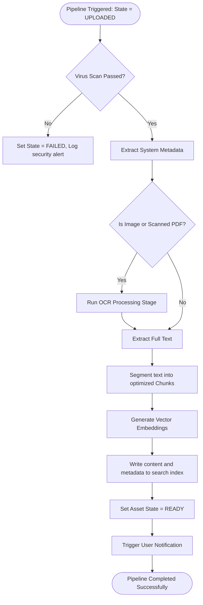

#### Main Flow
1.  The upload event triggers the Processing Engine.
2.  **Stage 1: Virus Scan.** System scans the asset. If clean, continue.
3.  **Stage 2: Metadata Extraction.** System extracts file size, mime type, page counts, and core details.
4.  **Stage 3: OCR.** (If image, OCR text extraction runs).
5.  **Stage 4: Text Extraction.** System pulls the raw textual content from the file structure.
6.  **Stage 5: Chunking & Embeddings.** System segments text and generates vectors.
7.  **Stage 6: Search Indexing.** System writes structural metadata and text chunks to the search indexes.
8.  System updates the asset state to `READY`.
9.  System records a `PROCESSING_PIPELINE_SUCCESS` event in the audit registry.
10. System triggers notifications to the asset owner.

#### Alternate Flows
*   **AI Offline Pipeline:** If AI is globally disabled, the system automatically skips OCR, Embeddings, and AI summaries, completing processing after Standard Search Indexing.

#### Failure Cases
*   **Virus Detected:** The scanner identifies malware. The processing pipeline is immediately halted. The asset state is changed to `FAILED`. The file is quarantined, and a security audit alert is generated.

#### Business Rules
*   The entire processing pipeline must run asynchronously.
*   The upload transaction must complete immediately without waiting for the pipeline to finish.

#### Final State
*   The asset is in `READY` (or `FAILED`) state, search-indexed, and logged in the system.

---

### 3.20 Notification Flow

#### Purpose
To alert users of important collaborative actions, system state updates, or compliance warnings in a timely manner.

#### Trigger
A system or user action generates an event (e.g., `ASSET_READY`, `MEMBER_JOINED`, `VERSION_UPLOADED`).

#### Preconditions
*   User must have notifications enabled in their profile.
*   The event must be valid.

#### Main Flow
1.  An event occurs that requires notification.
2.  System retrieves the list of users who should receive the notification (e.g., Workspace Admin for a new member, file owner for ingestion).
3.  System checks each user's preferences (e.g., In-app only, Email only, or Both).
4.  System builds the notification payload using business-friendly templates.
5.  System delivers the notification to the user's In-app Notification Center.
6.  If selected, the system routes the email to the corporate mail queue.
7.  System logs `NOTIFICATION_DELIVERED` in the database registers.

#### Alternate Flows
*   **Quiet Hours:** A workspace policy halts non-critical notifications during non-business hours, batching and delivering them the next business morning.

#### Failure Cases
*   **Mail Queue Failure:** The corporate mail gateway is offline. The system stores the mail and schedules retries every 15 minutes, while still ensuring the In-app notification remains accessible.

#### Business Rules
*   Critical security alerts (e.g., Login Failed, Password Changed) must ignore user preferences and always be sent via email immediately.

#### Final State
*   Notifications are successfully routed to target users' inboxes and dashboards.

---

### 3.21 Audit Logging

#### Purpose
To maintain a continuous, tamper-proof, and enterprise-ready compliance record of all platform activities.

#### Trigger
Any actor (user or system component) executes an audited business operation.

#### Preconditions
*   The Audit Logging module is initialized and active.
*   The trigger event contains complete context metadata.

#### Mermaid Sequence Diagram
```mermaid
sequenceDiagram
    actor Actor as Any Actor (User or System)
    participant Core as System Core
    participant Audit as Central Audit Ledger
    
    Actor->>Core: Execute Audited Action (e.g., Download File)
    Core->>Core: Capture context (Actor, Action, Target, IP, Date)
    Core->>Audit: Publish Audit Event to Immutable Ledger
    Audit->>Audit: Persist record to read-only compliance storage
    Note over Audit: Audit Event is now locked and unmodifiable
    Core-->>Actor: Return operation result (File Stream)
```

#### Main Flow
1.  An audited action occurs (e.g., `ASSET_DELETE`, `WORKSPACE_MEMBER_ADD`).
2.  System captures the full operational context:
    *   **Who:** User ID, email, and security role.
    *   **What:** Action type (Create, Update, Delete, Download).
    *   **Where:** Target Workspace ID and Resource ID.
    *   **When:** Exact UTC timestamp.
    *   **How:** Source IP address and client signature.
3.  System writes this context directly to the central Outbox queue.
4.  System processes the event and writes it to the central, write-once audit ledger.
5.  The audit record is locked and becomes completely read-only.
6.  System displays the event on the Workspace Activity Timeline or the Global compliance console.

#### Alternate Flows
*   **Compliance Export:** An Auditor requests a signed CSV export of the logs. The system compiles the logs, signs the output with a cryptographic hash, and logs `AUDIT_LOG_EXPORTED`.

#### Failure Cases
*   **Audit Logging Failure:** If the audit subsystem fails to record an event, the system must immediately halt the corresponding business action (e.g., if the audit log cannot write, a delete must not be allowed to complete) to maintain compliance integrity.

#### Business Rules
*   Audit logs must be completely immutable. No user, including Org Admins, can ever edit, modify, or delete an audit log entry.

#### Final State
*   A secure, unmodifiable record of the action is permanently written to the system compliance logs.

---

### 3.22 Asset Lifecycle

The lifecycle of an asset in AssetSphere is represented by a series of business states. These states manage what actions users can take on the asset and guide background processes.

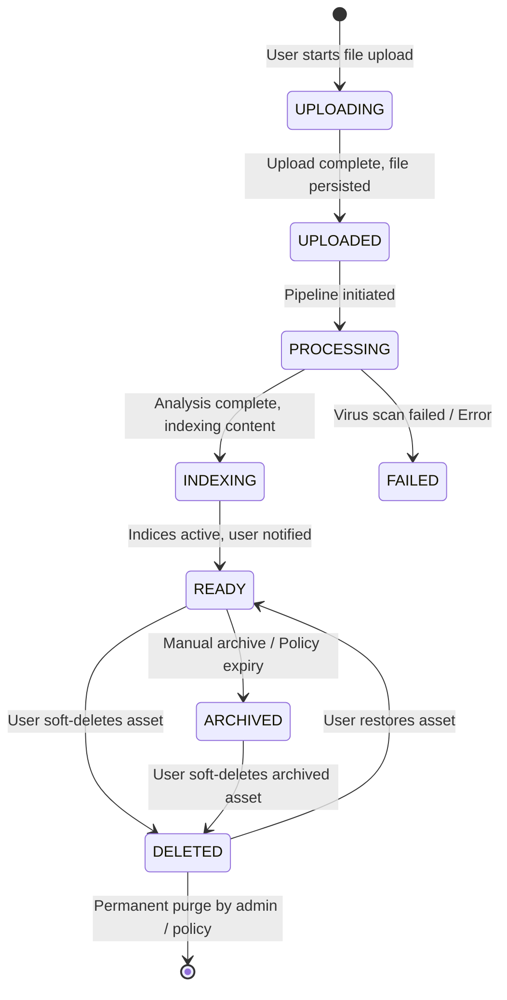

#### State Definitions
*   **UPLOADING:** The physical file is actively streaming to the storage vault. The logical asset record is not yet active.
*   **UPLOADED:** The file has successfully arrived in storage. The logical record is created, but the asset is not yet visible to general workspace members.
*   **PROCESSING:** The system is running background checks (malware scans, text extraction, OCR if needed).
*   **INDEXING:** Content and metadata are being written to the search indexes.
*   **READY:** The asset is fully indexed and verified. It is visible to all authorized workspace users for download, search, and collaboration.
*   **FAILED:** Ingestion failed (e.g., malware detected or processing error). The asset is locked, and administrators are alerted.
*   **ARCHIVED:** The asset is marked as read-only. It is hidden from standard daily searches but preserved in historical reports for compliance.
*   **DELETED:** The asset has been soft-deleted and is located in the Workspace Trash. It is recoverable within a retention window.

---

### 3.23 Workspace Lifecycle

Workspaces move through high-level lifecycle states governed by administrators to manage access and tenant health.

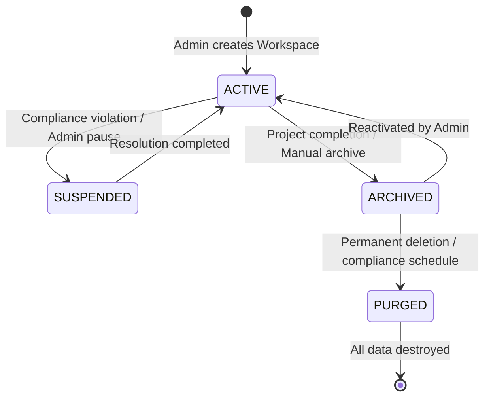

#### State Definitions
*   **ACTIVE:** The workspace is open for standard operations. Members can upload, download, and collaborate on assets.
*   **SUSPENDED:** Access is temporarily frozen. Users cannot log into the workspace, search, or access files. Suspended workspaces are under review by Organization Admins.
*   **ARCHIVED:** The workspace is in a read-only state. Assets cannot be modified, and new uploads are blocked. Users can still search and download historical assets.
*   **PURGED:** The workspace and all its underlying assets have been permanently deleted from storage.

---

## 4. Key Cross-Cutting Business Behaviors

### 4.1 Idempotency Rules
The system must guarantee that identical business transactions are processed exactly once. For example, if a network interruption causes a user to submit a "Restore Asset" request multiple times, the system must process the first request, and ignore subsequent requests without throwing error screens, ensuring a clean state.

### 4.2 Fallback Strategy when AI is Offline
If the optional AI Service (Ollama/OpenAI) is unavailable, the platform must degrade gracefully. Standard uploads, downloads, full-text keyword search, and metadata management must continue to operate flawlessly. The UI should gracefully hide or disable the AI Summary, AI Tagging, and Semantic Search elements, presenting clear tooltips that describe the service status without breaking the workspace.

---

## 5. Summary Matrix of Business Workflows

| Workflow | Initiated By | Critical Preconditions | Central Success State | Fail-Safe State |
| :--- | :--- | :--- | :--- | :--- |
| **Login** | User | Active Account | User authenticated & active session issued | Access rejected & locked |
| **Workspace Creation**| Org Admin | Name is unique | Workspace partition initialized | Reject creation with name warning |
| **Asset Upload** | WS Member | User in WS, file matches rules | Asset in storage, state is `UPLOADED` | Halt upload, file rejected |
| **Processing Pipeline**| System Engine| Asset status is `UPLOADED` | Asset status set to `READY` | Asset status set to `FAILED` |
| **Search (Full-Text)** | WS Viewer | User in WS | Matching assets returned in workspace | Empty results within secure scope |
| **Audit Log Entry** | System Core | Valid event context | Event written to immutable ledger | Process blocked if log fails |
| **Soft Delete** | WS Member | User in WS | State set to `DELETED`, moved to Trash | Retain original location |
| **Restore Asset** | WS Admin | Asset is `DELETED` | State set to `READY` | Blocked if parent WS is inactive |
| **Permanent Purge** | WS Admin | Asset is `DELETED` | Physically deleted from S3 | File preserved, delete halted |
