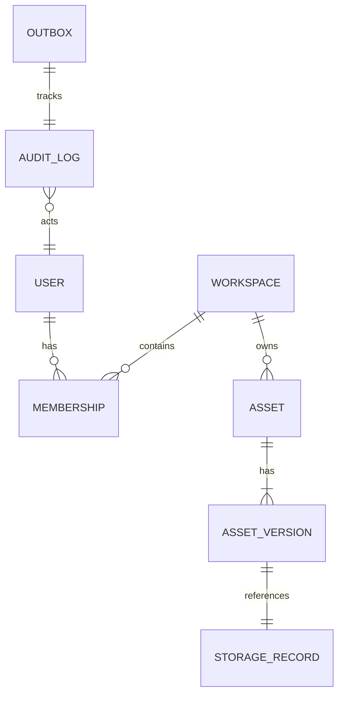

# Master Technical Design: AssetSphere

## 1. Architecture Overview

AssetSphere is designed as a **Modular Monolith** using **Spring Modulith** to enforce strict architectural boundaries while maintaining the simplicity of a single deployment unit.

### Architectural Pillars:
*   **Vertical Slice Architecture:** Each module is a self-contained business capability containing its own API, logic, and persistence layers. This minimizes cross-module coupling and improves developer velocity.
*   **Event-Driven Architecture (EDA):** Modules communicate primarily through asynchronous events (Spring Application Events internally, Kafka externally). This decouples the "source of truth" from "downstream effects" (e.g., Asset Upload vs. AI Processing).
*   **Clean Architecture & SOLID:** The domain logic is isolated from infrastructure concerns through interfaces. We strictly follow the **Open-Closed Principle**, allowing us to add new storage or AI providers without touching core business logic.
*   **Workspace Isolation:** A multi-tenant-like architecture where every entity is bound to a `WorkspaceID`. Security and data access layers enforce this boundary at every request.

### Why this architecture?
We chose a Modular Monolith over Microservices to avoid premature distributed systems complexity (network latency, distributed transactions, deployment overhead) while ensuring the code is "microservice-ready." If a module (e.g., `Processing`) needs to scale independently, it can be extracted with minimal refactoring.

---

## 2. Module Boundaries

### 2.1 Auth Module
*   **Responsibilities:** Identity verification, JWT generation, RBAC management.
*   **Public APIs:** `IdentityService` (get current user context).
*   **Entities:** `User`, `Role`, `Permission`.
*   **Published Events:** `UserLoggedIn`, `UserRegistered`.
*   **Dependencies:** Common.

### 2.2 Workspace Module
*   **Responsibilities:** Workspace lifecycle, membership management, invitation logic.
*   **Public APIs:** `WorkspaceService` (validate membership).
*   **Entities:** `Workspace`, `Membership`, `Invitation`.
*   **Published Events:** `WorkspaceCreated`, `MemberJoined`.
*   **Dependencies:** Auth, Common.

### 2.3 Asset Module
*   **Responsibilities:** Asset metadata, versioning lifecycle, state transitions.
*   **Entities:** `Asset`, `AssetVersion`.
*   **Published Events:** `AssetUploaded`, `AssetDeleted`, `VersionCreated`.
*   **Dependencies:** Workspace, Common.

### 2.4 Storage Module
*   **Responsibilities:** Physical file orchestration, provider selection, signed URL generation.
*   **Internal Components:** `StorageProviderBridge`.
*   **Entities:** `StorageRecord`.
*   **Published Events:** `AssetStored`.
*   **Dependencies:** Common, Infrastructure.

### 2.5 Processing Module
*   **Responsibilities:** Asynchronous pipeline orchestration, retry logic, outbox management.
*   **Internal Components:** `PipelineOrchestrator`, `StageStrategy`.
*   **Published Events:** `ProcessingStarted`, `ProcessingCompleted`, `ProcessingFailed`.
*   **Consumed Events:** `AssetStored`.
*   **Dependencies:** Asset, Common, Infrastructure.

### 2.6 Search Module
*   **Responsibilities:** Metadata filtering, full-text search, semantic search integration.
*   **Internal Components:** `HybridSearchEngine`.
*   **Consumed Events:** `AssetReady`, `SearchIndexed`.
*   **Dependencies:** Asset, Common.

### 2.7 Intelligence Module (Optional)
*   **Responsibilities:** AI service abstraction, OCR, summarization, embedding generation.
*   **Internal Components:** `IntelligenceProviderBridge`.
*   **Published Events:** `OCRCompleted`, `SummaryGenerated`, `EmbeddingGenerated`.
*   **Dependencies:** Common, Infrastructure.

### 2.8 Notification Module
*   **Responsibilities:** Multi-channel alerting (In-app, Email).
*   **Consumed Events:** `*Requested`.
*   **Dependencies:** Common.

### 2.9 Audit Module
*   **Responsibilities:** Global activity ledger, entity auditing, compliance reporting.
*   **Consumed Events:** All domain events.
*   **Entities:** `AuditLog`.
*   **Dependencies:** Common.

### 2.10 Common Module
*   **Responsibilities:** Base classes, shared DTOs, custom exceptions, constants.
*   **Dependencies:** None.

### 2.11 Infrastructure Module
*   **Responsibilities:** External client implementations (Kafka, Redis, S3, OpenAI, Postgres).
*   **Dependencies:** Common.

---

## 3. Domain Model

### Aggregate Roots:
*   **User:** Owns identity and platform-level settings.
*   **Workspace:** Owns memberships and invitations.
*   **Asset:** Owns versions and metadata.
*   **AuditLog:** Immutable stream of events.

### Ownership Rules:
1.  A **User** can have multiple **Memberships**.
2.  A **Membership** belongs to exactly one **Workspace**.
3.  An **Asset** belongs to exactly one **Workspace**.
4.  An **Asset** has one or more **AssetVersions**.
5.  A **Version** points to a physical storage record.

### Business Invariants:
*   An asset version content is **immutable**.
*   A workspace must have at least one `ADMIN` member.
*   Only one version of an asset can be `LATEST` at any time.

---

## 4. Database Design

### ER Diagram (Mermaid)


### Table Specifications:
*   **users:** `id (PK)`, `email (UQ)`, `password_hash`, `status`, `created_at`.
*   **workspaces:** `id (PK)`, `name`, `slug (UQ)`, `status`, `created_at`.
*   **memberships:** `user_id (FK)`, `workspace_id (FK)`, `role (ENUM)`, `joined_at`.
*   **assets:** `id (PK)`, `workspace_id (FK)`, `name`, `current_version`, `status (ENUM)`, `checksum (SHA256)`, `is_deleted`.
*   **asset_versions:** `id (PK)`, `asset_id (FK)`, `version_number`, `storage_path`, `size`, `mime_type`, `created_by`, `created_at`.
*   **outbox:** `id (PK)`, `event_type`, `payload (JSON)`, `status`, `created_at`.
*   **audit_logs:** `id (PK)`, `workspace_id`, `user_id`, `action`, `resource_type`, `resource_id`, `metadata (JSONB)`.

**Common Columns (Auditing):** `created_at`, `updated_at`, `created_by`, `updated_by`, `version (Optimistic Lock)`.

---

## 5. Event Catalog

| Event | Publisher | Consumer(s) | Payload |
| :--- | :--- | :--- | :--- |
| `WorkspaceCreated` | Workspace | Audit, Notification | `workspaceId, ownerId` |
| `AssetUploaded` | Asset | Storage | `assetId, tempFilePath` |
| `AssetStored` | Storage | Processing | `assetId, versionId, storagePath` |
| `ProcessingStarted`| Processing| Audit | `assetId, versionId` |
| `MetadataExtracted`| Processing| Search | `assetId, metadataJson` |
| `OCRCompleted` | Intelligence| Processing, Search | `assetId, rawText` |
| `SummaryGenerated` | Intelligence| Asset, Search | `assetId, summaryText` |
| `AssetReady` | Processing | Notification, Search| `assetId, versionId` |
| `AssetDeleted` | Asset | Storage, Search | `assetId, workspaceId` |

---

## 6. Processing Pipeline

The pipeline is a sequential chain of workers managed by the `Processing` module.

1.  **Virus Scan:** Checks `AssetStored` file. *Fail: Mark Asset FAILED, Quarantine.*
2.  **Metadata Extraction:** Reads MIME, dimensions, page count.
3.  **OCR (Conditional):** Triggered if MIME is Image/PDF and AI is enabled.
4.  **Text Extraction:** Converts binary content to raw text.
5.  **Chunking:** Splits text for indexing and LLM context windows.
6.  **Embedding (Conditional):** Generates vector if AI is enabled.
7.  **Search Indexing:** Pushes metadata + text to Full-Text and Vector indexes.
8.  **AI Summary (Conditional):** Generates summary if enabled.
9.  **Completion:** Updates status to `READY`, publishes `AssetReady`.

**Reliability:**
*   **Retry:** Exponential backoff for transient AI/Storage failures.
*   **Idempotency:** SHA-256 checksum check at the start of each stage.
*   **Timeout:** 30s per stage; 5m for total pipeline.

---

## 7. System Design Concepts

*   **Idempotency:** All pipeline stages check the `checksum` and `AssetStatus` to prevent duplicate processing.
*   **Outbox Pattern:** Events are saved to the `outbox` table in the same transaction as the business change. A background worker polls and publishes to Kafka.
*   **Redis Caching:** Used for `UserContext`, `WorkspaceSettings`, and `LatestVersion` metadata.
*   **Distributed Lock:** Redis-based locks used during `Version Promotion` to prevent concurrent `LATEST` conflicts.
*   **Rate Limiter:** Token-bucket limiter per `API_KEY` or `USER_ID`.
*   **Optimistic Locking:** JPA `@Version` on Assets and Workspaces to prevent lost updates.
*   **Async Processing:** Pipeline stages run in a dedicated thread pool, isolated from HTTP request threads.

---

## 8. Design Patterns

*   **Strategy:** Used in `StorageModule` to switch between S3 and MinIO based on profiles.
*   **Factory:** `IntelligenceProviderFactory` creates Ollama or OpenAI clients.
*   **Chain of Responsibility:** The `ProcessingPipeline` executes stages in a defined sequence.
*   **Observer:** Internal modules subscribe to `ApplicationEvents` for low-latency coupling.
*   **Builder:** Complex DTO construction for Search Queries and AI Prompts.
*   **State Pattern:** Manages `AssetStatus` transitions (`UPLOADING` -> `READY`).

---

## 9. API Design

### Auth
*   `POST /api/v1/auth/login`: Returns JWT + Refresh Token.
*   `POST /api/v1/auth/register`: Onboards new user.

### Workspace
*   `POST /api/v1/workspaces`: Creates new workspace.
*   `GET /api/v1/workspaces/{id}/members`: Lists members.

### Asset
*   `POST /api/v1/workspaces/{workspaceId}/assets`: Multipart upload with an `Idempotency-Key`.
*   `GET /api/v1/workspaces/{workspaceId}/assets`: Lists workspace asset metadata.
*   `GET /api/v1/workspaces/{workspaceId}/assets/{assetId}`: Returns asset metadata.

### Search
*   `GET /api/v1/workspaces/{workspaceId}/search?q=query`: Workspace-scoped lexical search results.

---

## 10. Security Design

*   **JWT:** Stateless authentication with `sub` (UserId) and `custom_claims` (OrganizationId).
*   **RBAC:** Permissions like `ASSET_DELETE`, `WORKSPACE_MANAGE`.
*   **Workspace Isolation:** Every repository call includes a mandatory `workspace_id` filter (enforced via Hibernate Filters or Aspect-Oriented Programming).
*   **CORS:** Strictly restricted to the frontend domain.
*   **Security Headers:** HSTS, X-Content-Type-Options, CSP.

---

## 11. Search Architecture

*   **Metadata Search:** Postgres `jsonb` indexing for custom tags.
*   **Full-Text Search:** Postgres `tsvector` or dedicated Elastic/Solr (Postgres `tsvector` for MVP).
*   **Semantic Search:** Vector similarity search (pgvector) using AI-generated embeddings.
*   **Hybrid Search:** Combined score of Keyword (BM25) + Semantic Similarity.

---

## 12. AI Architecture (Optional Layer)

*   **Abstraction:** `IntelligenceProvider` interface.
*   **Implementations:** `OllamaProvider` (Local Dev), `OpenAIProvider` (Prod).
*   **Failure Handling:** If AI provider returns 5xx, the stage is marked "SKIPPED", allowing the pipeline to complete without AI enrichment.

---

## 13. Storage Architecture

*   **Deduplication:** Checksum-based storage. If SHA-256 matches an existing file, the `AssetVersion` points to the existing `storage_path`.
*   **Versioning:** S3 Object Versioning is **NOT** used; we manage versions logically in the database to remain provider-agnostic.
*   **Signed URLs:** Used for direct-to-S3 uploads in production to bypass backend bottlenecks.

---

## 14. Dev vs Production Profiles

| Feature | Dev Profile | Prod Profile |
| :--- | :--- | :--- |
| **Database** | Local Postgres | Managed AWS RDS |
| **Messaging** | In-Memory / Local Kafka | Managed MSK |
| **Storage** | MinIO (Docker) | AWS S3 |
| **AI** | Ollama (Local) | OpenAI / Azure AI |
| **Caching** | Embedded Redis | ElastiCache |

---

## 15. Deployment Architecture

*   **Packaging:** Single JAR file.
*   **Containerization:** Multi-stage Dockerfile.
*   **Observability:** 
    *   **Actuator:** `/health`, `/metrics`, `/info`.
    *   **Prometheus/Grafana:** For system metrics.
    *   **ELK Stack:** For centralized log aggregation.
*   **Health Checks:** Readiness check depends on DB and Kafka availability.

---

## 16. Folder Structure

```text
com.assetsphere
├── infrastructure (Technical Implementations)
│   ├── config
│   ├── security
│   ├── persistence
│   ├── kafka
│   ├── redis
│   └── storage (S3/Minio)
├── modules
│   ├── auth
│   │   ├── api (Controllers)
│   │   ├── domain (Service, Entity, Repository)
│   │   └── dto
│   ├── workspace
│   ├── asset
│   ├── storage (Business Logic)
│   ├── processing
│   ├── search
│   ├── intelligence
│   ├── notification
│   ├── audit
│   └── common
└── AssetSphereApplication.java
```

---

## 17. Future Extension Points

*   **Payments (OCP):** Add a `PaymentModule` that listens to `WorkspaceCreated` to initiate billing.
*   **Workflow Automation:** A `WorkflowModule` can be added to orchestrate complex state transitions across assets.
*   **Microservice Extraction:** The `Processing` module is already decoupled via Kafka; it can be moved to a separate repository with zero changes to the `Asset` module's domain logic.

## 18. Deterministic Processing and Lexical Search (MVP)

`AssetUploaded` is delivered through the transactional outbox, Kafka, the processing lock, and `processed_events`. The processing transaction streams the stored binary, extracts bounded PDF/DOCX text, persists one text-content row per AssetVersion, indexes metadata plus text in PostgreSQL `tsvector`/GIN, and only then marks the Asset and AssetVersion `READY`. Images complete without fabricated OCR text. OCR, embeddings, semantic search, and RAG remain deferred; asynchronous Intelligence v1 is described below.

## 19. Intelligence v1

After deterministic Processing reaches `READY`, it publishes `asset.ready-for-intelligence.v1` synchronously to the existing transactional outbox. Kafka contains identifiers only; Intelligence obtains bounded extracted content through Processing's public API. One Intelligence record is persisted per AssetVersion with its own lifecycle (`PENDING`, `PROCESSING`, `READY`, `FAILED`, `NOT_APPLICABLE`, or `DISABLED`), so an AI failure never changes an Asset that is already `READY`. The provider-neutral Intelligence port keeps Spring AI/OpenAI types in Infrastructure. Prompts treat document text as untrusted content, validated structured output persists only summary, key points, tags, and safe metadata, and embeddings/semantic search/RAG remain deferred.
