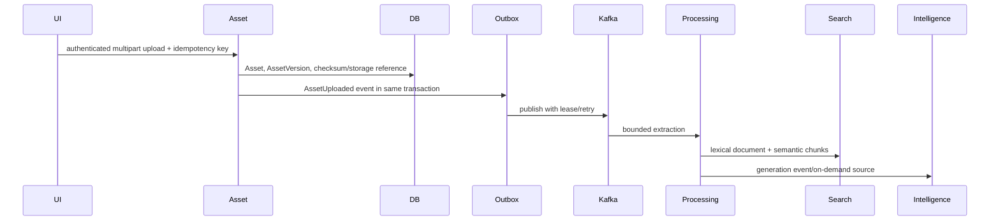

# Architecture

AssetSphere is a Spring Modulith modular monolith. Domain boundaries include Auth, Workspace, Asset, Processing, Search, Intelligence, Audit, Billing, Storage, and shared infrastructure. Public module APIs define allowed dependencies; persistence entities stay inside their owning module.

## Upload and Processing

Uploads and explicit appended versions reuse checksum-based physical storage deduplication. Optimistic/pessimistic controls prevent duplicate version numbers. Kafka consumers retain retry and dead-letter behavior, while distributed Redis locks prevent concurrent processing of the same version.

## Retrieval and AI

Search owns lexical SQL, embeddings, pgvector `<=>` retrieval, and reciprocal-rank hybrid merging. Normal Search and Ask retrieve only each asset's latest version; history remains available through version history and Evolution comparison. Intelligence depends only on the bounded Search API for Workspace RAG; it never duplicates Search SQL.

## Security and Isolation

JWT authentication produces a framework-neutral current user. Every workspace route requires active membership before data access or provider calls. Repositories and SQL include workspace predicates. Inputs, AI contexts, outputs, page sizes, rate limits, and quotas are bounded.

## Billing and Payments

Plan entitlements are centralized in Billing. One `BillingPayment` owns at most one provider payment. Failed retries create new payment/order records. Stripe subscription periods come from verified provider events when supplied, and conflicting active subscription IDs are rejected rather than overwritten.

## Reliability

- Transactional outbox for durable event publication
- Kafka retry/DLT paths with root-cause logging
- Redis rate limits, caches, and distributed locks
- Idempotency records for uploads and checkout reservations
- Flyway-managed PostgreSQL schema and pgvector indexes
- Actuator health, readiness, and liveness probes

Kafka consumers use bounded retries before topic-specific DLT publication. Operator replay validates the workspace and payload, resets feature-owned FAILED asset/semantic state, then republishes the unchanged business event identity. Malformed poison events are rejected; Kafka remains authoritative and no parallel database DLQ exists. In production, a FREE-plan OCR entitlement rejection exercised the bounded retry/DLT path; operator replay remains an explicit operational action.

Operational retention for refresh tokens, idempotency records, processed events, outbox rows, webhook events, audits, and failed payment history is a post-hackathon concern; no generalized destructive cleanup runs automatically.

JPA auditing uses the authenticated user UUID for request-owned writes. Background, webhook, scheduler, signup, and Kafka writes without an authenticated principal use the reserved nil UUID (`00000000-0000-0000-0000-000000000000`) as the explicit system principal; original `created_by` values remain immutable while `updated_by` follows the current actor.
