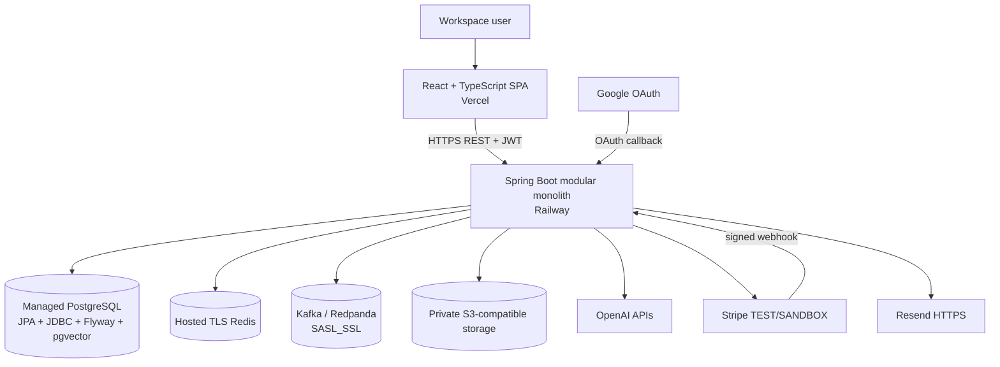
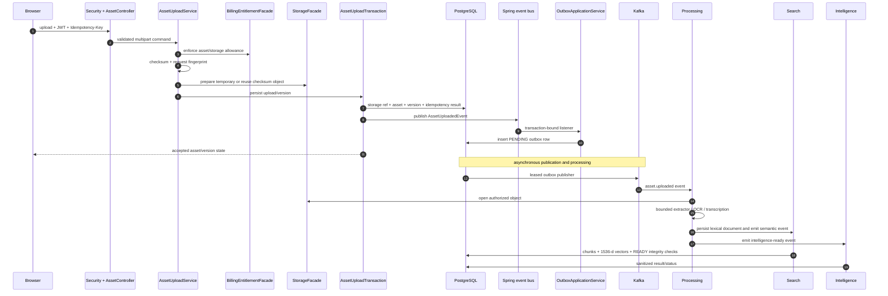
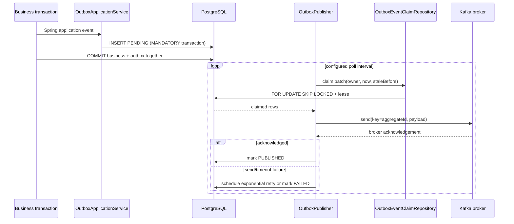
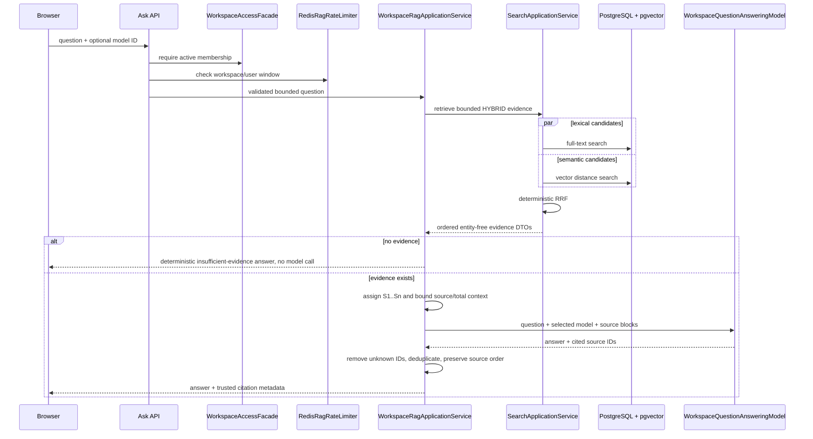
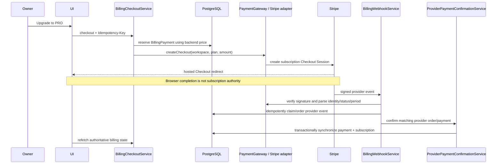

# AssetSphere Technical Architecture

This document explains the current AssetSphere design: the problems each boundary addresses, the implementation used, why it was selected, and the trade-offs it introduces.

## Architecture Goals

AssetSphere is designed to:

- isolate every workspace at the API, application, repository, and provider-call boundaries;
- keep file upload responsive while extraction, indexing, and intelligence run asynchronously;
- preserve immutable asset history and exact-version behavior;
- combine lexical and semantic retrieval without duplicating Search logic inside Intelligence;
- make retries and duplicate delivery safe at the boundaries where they can occur;
- isolate external providers behind application-owned contracts;
- enforce plan entitlements and usage on the backend before expensive work;
- expose enough health, metrics, audit, and failure state for operations without logging sensitive content.

## Constraints

- One Spring Boot deployable is preferred for the hackathon/MVP operating model.
- PostgreSQL is the authoritative transactional store; object storage, Kafka, Redis, and providers cannot participate in its local transaction.
- Kafka delivery and publisher retry are at-least-once. Consumers must tolerate duplicates; exactly-once delivery is not claimed.
- AI inputs and outputs must be bounded and scoped to an already-authorized feature request.
- Production uses managed external services, but local development must remain possible with Docker-hosted dependencies and optional provider features.
- Flyway migrations V1-V17 are immutable schema history.

## System Context and Containers

MinIO substitutes for S3-compatible storage locally. SMTP can substitute for Resend. `RAZORPAY_LOCAL` can substitute for Stripe only in development; the production profile rejects it.

## Modular Monolith Rationale

### Problem

Asset, processing, search, intelligence, workspace, and billing have different ownership rules. Keeping everything in one package would make accidental coupling easy, but separating them into networked services would introduce distributed consistency and deployment work before independent scaling is needed.

### Decision

Use one Spring Boot application with Spring Modulith modules and named API interfaces.

### Implementation

Each business package declares `@ApplicationModule(allowedDependencies = ...)`. Cross-module calls go through named `api` packages. Persistence entities and repositories stay in the owning module. Spring Modulith verification protects these dependencies.

### Why

- One deployment and one local PostgreSQL transaction where appropriate.
- Lower operational cost than premature microservices.
- Explicit business ownership rather than package naming alone.
- Provider ports and module APIs create intentional seams for future change.

### Trade-off

Modules still share one runtime and database. A future extraction would require a real network contract, data ownership transition, and operational work; “microservice-ready” is not treated as a guarantee.

## Module Ownership and Dependency Direction

| Module | Owns | Representative public boundary |
|---|---|---|
| `auth` | Credentials, refresh tokens, JWT/OAuth security | current-user/security APIs |
| `workspace` | Workspace, membership, role, invitation | `WorkspaceAccessFacade` |
| `asset` | Logical assets, versions, upload idempotency, asset state | asset controllers and `AssetReadFacade` |
| `storage` | Physical object references and provider abstraction | `StorageFacade`, `AssetStorage` |
| `processing` | Extraction and outbox publication lifecycle | processing events and `OutboxMessagePublisher` |
| `search` | Search documents, chunks, embeddings, retrieval/RRF | `WorkspaceSearchEvidenceRetriever`, `EmbeddingModelPort` |
| `intelligence` | RAG, intelligence, Evolution, insights, quizzes | model ports and API DTOs |
| `billing` | Subscription, payment, entitlements, usage periods | `BillingEntitlementFacade`, `PaymentGateway` |
| `audit` | Durable activity records | `AuditService`, `WorkspaceActivityQuery` |
| `common` | Small cross-cutting contracts | exception, security, time, persistence, web named interfaces |
| `infrastructure` | Concrete external adapters | Redis, Kafka, OpenAI, object storage, payment, email |

Dependency direction is inward: controllers and adapters depend on application/module contracts; application services depend on domain objects and ports; domain objects do not depend on provider SDKs. This demonstrates Dependency Inversion where the code has a real provider boundary.

## Domain Model Concepts

- `Asset` is the logical identity and holds current metadata plus `latestVersionNumber`.
- `AssetVersion` is immutable file/version history with filename, MIME type, checksum, storage reference, and processing status.
- `StorageObject` represents a workspace-scoped physical object and reference count.
- `IdempotencyRecord` binds a user/workspace/key to a request fingerprint and replay result.
- `OutboxEvent` owns pending, processing, retry, published, and terminal-failure transitions.
- Search documents and content chunks are version-specific derived data.
- Intelligence records hold sanitized business output/status, not arbitrary provider objects.
- `Subscription`, `BillingPayment`, usage rows, and provider-event state separate entitlement, payment attempt, metering, and webhook ordering concerns.
- `AuditRecord` is a durable business activity entry, distinct from diagnostic application logs.

## Synchronous Request Lifecycle

A normal authenticated workspace request follows this order:

1. Spring Security validates the JWT and establishes the current user.
2. The controller validates transport DTOs and delegates to an application service.
3. The application service calls `WorkspaceAccessFacade` before workspace data or provider access.
4. Entitlement/rate-limit checks run before expensive storage, embedding, or generation work.
5. Domain methods enforce lifecycle invariants; repositories persist module-owned state.
6. Controllers return typed API responses; expected failures are mapped by the global exception handler.

Controllers do not decide tenant access, payment authority, or AI grounding.

## Upload and Processing Sequence

The synchronous request establishes durable intent. The asynchronous path performs expensive work and updates `PROCESSING`, `READY`, or `FAILED` state honestly.

## Transactional Outbox Internals

### Problem

Writing asset state and directly publishing Kafka are two independent operations. A database commit followed by a failed send loses work; a send followed by rollback exposes an event for state that never committed.

### Decision

Persist an outbox event in the original transaction, then publish it asynchronously.

### Implementation

- `AssetUploadTransaction` and processing services publish internal Spring events.
- `OutboxApplicationService` handles supported events with `@EventListener` and `@Transactional(propagation = Propagation.MANDATORY)`.
- `OutboxEventClaimRepository` atomically claims eligible rows using PostgreSQL `FOR UPDATE SKIP LOCKED`.
- A claim records owner and timestamp. Stale `PROCESSING` claims become eligible after the configured lease duration.
- `KafkaOutboxMessagePublisher` waits for `KafkaTemplate` acknowledgement within a configured timeout.
- `OutboxPublishingStateService` marks publication or calculates bounded exponential retry; terminal publisher failure is stored separately from consumer DLT state.

### Why PostgreSQL Claiming Instead of Redis Ownership?

The outbox rows and their durable publication state already live in PostgreSQL. Claiming them in the same database gives atomic selection/state change and stale-lease recovery without a second source of truth. Redis locks are used instead where there is no natural durable row-claim boundary, such as version-specific consumer work.

### Trade-off

Polling introduces bounded latency and the publisher can resend after uncertain failure. Stable event identity and duplicate-tolerant consumers are therefore still required.

## Kafka Publication and Consumer Reliability

Publisher retry and consumer retry solve different failures:

- **Publisher layer:** could not obtain broker acknowledgement for an outbox row.
- **Consumer layer:** Kafka has the event, but extraction, provider access, or persistence failed.

`KafkaReliabilityConfiguration` defines topic-specific retry/DLT behavior and logs terminal exceptions with safe event/workspace/asset/version identifiers. Non-retryable exception classification prevents pointless repeats. DLT publication is not the same as terminal outbox failure.

When explicitly enabled, `DltOperationsController` permits OWNER/ADMIN inspection and replay scoped to a workspace. `DltOperationsService` validates payload identity and prepares failed feature state before republishing the original event identity. This is controlled operations, not an automatic infinite loop.

## Redis Responsibilities

| Responsibility | Implementation | Failure stance |
|---|---|---|
| Metadata caching | `RedisAssetMetadataCache` stores stable `AssetMetadataSnapshot` values, never JPA entities or authorization state | Read/write/eviction failures are skipped so database reads remain available |
| Cache invalidation | Metadata/update/processing paths evict; transaction synchronization performs post-commit eviction where needed | Avoids advertising uncommitted mutation through cache behavior |
| Upload limiting | `RedisAssetUploadRateLimiter` keyed by workspace and user | Limiter unavailability becomes a typed service failure rather than silently disabling protection |
| Semantic-search limiting | `RedisSemanticSearchRateLimiter` | Same fail-closed operational stance |
| RAG limiting | `RedisRagRateLimiter` using `assetsphere:rate-limit:rag:{workspaceId}:{userId}` | Applied after authorization and before retrieval/provider invocation |
| Distributed processing lock | `RedisAssetProcessingLock` with owner token | Prevents concurrent work for one version |
| Intelligence lock | `RedisIntelligenceProcessingLock` | Prevents duplicate intelligence processing |
| Semantic-index lock | `RedisSemanticIndexingLock` | Prevents duplicate chunk/vector persistence |

Redis is not the authoritative store for assets, subscriptions, usage, outbox state, or authorization.

## Storage Consistency and Deduplication

### Problem

Object storage cannot commit atomically with PostgreSQL. A failed request can otherwise leave orphaned objects, while identical uploads can waste storage.

### Decision

Use a provider-neutral object-storage port with workspace-scoped checksum deduplication and explicit compensation.

### Implementation

`StorageApplicationService.prepare(...)` first checks `(workspaceId, checksumSha256)`. Existing content reuses the canonical object and later increments its reference count. New content is written to a temporary key. Within the asset transaction, `attach(...)` performs an atomic upsert of the storage reference. The temporary object is copied to a canonical checksum key and removed. Failures delete temporary/canonical candidates where applicable, and `AssetUploadService` compensates unsuccessful preparation/idempotency state.

### Why Object Storage Instead of Database BLOBs?

PostgreSQL remains focused on transactional metadata and queryable derived text. Object storage is designed for binary size and streaming. The trade-off is explicit cross-system lifecycle coordination rather than a single database transaction.

## Search Architecture

### Lexical

`AssetSearchDocumentRepository` stores version-derived search documents and executes PostgreSQL full-text queries. Workspace and latest-version predicates prevent cross-tenant and stale-version results.

### Semantic

`SemanticIndexingApplicationService` chunks extracted text, calls `EmbeddingModelPort`, validates 1536-dimensional vectors, persists pgvector values, and does not mark an index READY when expected vectors are incomplete. Retrieval uses cosine distance through `<=>` and maps similarity as `1 - distance`.

### Hybrid RRF

`SearchApplicationService` obtains lexical and semantic candidates independently, then adds reciprocal rank contributions using a fixed fusion constant and deterministic tie-breaking. RRF avoids pretending that PostgreSQL lexical scores and vector similarity are directly calibrated.

### Why PostgreSQL + pgvector?

The MVP already requires PostgreSQL for durable tenant/version state. pgvector keeps relational filters and vector retrieval together and avoids another operational database. The trade-off is that very large future vector workloads may justify a dedicated retrieval service after measurement.

## Search and Grounded RAG Sequence

Retrieval is separated from generation so Search owns ranking and SQL while Intelligence owns prompts, model selection, output validation, and citation trust.

## Multimodal Extraction and Intelligence

`TextExtractionService` selects a format-specific `TextExtractor`. PDF/DOCX/text/Markdown/CSV/JSON/XLSX/PPTX extractors are bounded and do not execute arbitrary formulas or macros. `ImageTextExtractor` delegates authorized PNG/JPEG/WebP content to an OCR provider. `VideoTextExtractor` delegates MP4/WebM content to the configured transcription provider. Unsupported content fails through the processing lifecycle rather than crashing the HTTP upload transaction.

All extracted text passes through the shared text-content boundary, including NUL sanitization for PostgreSQL text safety. The result feeds lexical indexing, semantic chunking, grounded Ask, and on-demand intelligence.

Provider-neutral model interfaces keep OpenAI types out of application services. Result sanitizers bound summaries and collections, truncate excess untrusted list output, and reject unusable structures. Prompts treat source material as untrusted data and forbid following instructions embedded inside assets.

## Versioning and Evolution Architecture

Initial upload creates a new logical `Asset` and Version 1. Only the explicit append-version endpoint creates Version 2+ on that asset. Same filename or checksum does not automatically choose a logical asset relationship.

`AssetRepository.findForUpdate(assetId, workspaceId)` uses `PESSIMISTIC_WRITE`; the locked `Asset.appendVersion(...)` increments `latestVersionNumber`, and a new immutable `AssetVersion` receives that number. The same upload idempotency/fingerprint and storage-dedup flow applies, and the same downstream event starts extraction/indexing/intelligence.

Normal Search and Ask use latest versions. Version history, specific-version download, exact-version Intelligence, and Evolution retain historical access. Evolution sends only the two selected authorized bounded texts and trusted version metadata to its provider port.

## Authentication, RBAC, and Workspace Isolation

Spring Security permits only documented public routes such as authentication, plans, invitation validation, Swagger/health, OAuth, and signed webhook endpoints. Other routes require authentication. JWT access tokens are validated by `JwtAuthenticationFilter`; passwords use BCrypt; refresh tokens rotate; Google OAuth is feature-gated.

Authentication establishes identity, but application authorization establishes tenant access. `WorkspaceAccessFacade.requireActiveMembership(...)` and `requireRole(...)` are called before workspace reads, writes, retrieval, storage access, and provider invocation. OWNER/ADMIN rules govern member administration and DLT operations; billing mutation remains owner-controlled. Repository methods retain workspace predicates so an asset/version ID alone is insufficient.

## Billing and Payment Architecture

Plan definitions and entitlements are centralized in Billing. Asset/storage capacity and period-based AI/Ask/Evolution/quiz usage are checked on the backend. `BillingUsageRepository` uses atomic SQL to increment within a limit; operation-aware usage supports idempotent consumption where a stable operation ID exists.

`PaymentGateway` abstracts checkout creation, webhook verification, and optional cancellation. `StripePaymentGateway` creates subscription Checkout from backend-owned pricing and builds workspace-specific return URLs. The browser success/cancel query is presentation only.

Stripe subscription identity, event occurrence ordering, authoritative period fields, and cancel-at-period-end state are synchronized from verified events. Conflicting active subscription IDs are rejected rather than overwritten. Production permits Stripe only; `RAZORPAY_LOCAL` is an explicit development adapter and cannot activate production behavior.

## Audit and Observability

`AuditService` writes durable `AuditRecord` entries for business actions such as uploads, workspace changes, invitations, and membership changes. `WorkspaceActivityQuery` returns bounded recent activity after workspace authorization. This audit trail is distinct from diagnostic logs.

Operational observability includes:

- Actuator aggregate health, readiness, and liveness endpoints;
- Micrometer counters in Kafka/DLT and intelligence paths;
- correlation IDs in API error responses and logging context;
- safe terminal-failure logs with event/workspace/asset/version identifiers and stack traces;
- no normal logging of raw documents, chunks, embeddings, prompts, model responses, credentials, or secrets.

## Failure Modes

| Failure | Boundary/response | Recovery or resulting state |
|---|---|---|
| Client retries same upload | Idempotency key + matching fingerprint | Prior response is replayed; no duplicate logical write |
| Client reuses key with changed request | Fingerprint mismatch | Typed conflict |
| Object upload fails before DB work | Storage preparation | Request fails; prepared artifacts are compensated where present |
| DB transaction rolls back | Local PostgreSQL transaction | Asset/version/outbox state rolls back together; canonical candidate cleanup runs |
| Outbox publisher instance stops | Claim lease | Stale claim becomes available to another publisher |
| Kafka send fails/times out | Publisher state service | Bounded exponential retry, then terminal outbox FAILED state |
| Consumer transient failure | Kafka listener container | Bounded retries |
| Consumer non-retryable/exhausted failure | DLT recoverer | Topic-specific DLT plus failed feature status/log evidence |
| Duplicate consumer delivery | Stable identity/state/locks | Duplicate work is suppressed or state transition remains idempotent |
| Redis metadata cache unavailable | Cache adapter | Database path remains available |
| Redis limiter unavailable | Protected API boundary | Typed service-unavailable response; protection is not silently bypassed |
| Embedding provider unavailable | Semantic/hybrid path | Semantic request fails typed; bounded hybrid evidence may fall back to lexical candidates |
| No RAG evidence | RAG service | Deterministic insufficient-evidence response without model call or usage consumption |
| AI provider unavailable | Provider port/adapter | Typed service failure; asynchronous flows retain retry/DLT behavior |
| Browser claims payment success | UI redirect | No entitlement change until verified provider confirmation |
| Duplicate/stale webhook | Webhook claim and provider event ordering | Duplicate is harmless; stale state cannot overwrite newer provider state |

## Consistency Model

| Data | Authority | Consistency |
|---|---|---|
| Workspace, asset, version, subscription, usage | PostgreSQL | Strong within local transactions |
| Binary bytes | Private object storage | Coordinated through preparation, canonicalization, references, and compensation |
| Kafka publication | PostgreSQL outbox + broker acknowledgement | Eventual, at-least-once-safe |
| Derived search/intelligence | PostgreSQL, written asynchronously | Eventual; UI exposes processing states |
| Asset metadata cache | Redis | Best-effort derived cache; database remains authoritative |
| Processing locks/rate windows | Redis | Ephemeral coordination |
| Payment subscription state | PostgreSQL synchronized from verified Stripe events | Eventual and provider-authoritative |

## Deployment Topology

The hackathon deployment uses Vercel for the frontend and Railway for the backend. The backend connects to managed PostgreSQL/pgvector, hosted TLS Redis, hosted Kafka/Redpanda over SASL_SSL, private S3-compatible storage, OpenAI, Stripe TEST/SANDBOX, Resend HTTPS, and Google OAuth. The production profile removes production-critical localhost fallbacks, validates selected Stripe configuration, disables bucket auto-creation, and rejects local Razorpay mode.

Local development substitutes Docker-hosted PostgreSQL/pgvector, Redis, Kafka, and MinIO; optional AI, OAuth, email, and payment providers can be disabled or configured explicitly.

## Trade-offs and Future Scaling Boundaries

- **Outbox polling:** simple and durable, but a high-volume future system may use database change capture after measuring need.
- **Single PostgreSQL + pgvector:** minimizes infrastructure and preserves relational filtering; very large vector workloads could justify an independently scaled search store.
- **One deployable:** simplifies transactions and operations; CPU-heavy processing could later be extracted behind existing event/API contracts if scaling data supports it.
- **Redis locks:** practical for version-specific distributed work, but require bounded lease design and should not replace durable state.
- **Provider dependence:** OpenAI-backed capabilities are optional and isolated, but enabled features still inherit provider availability and latency.
- **Compensation:** appropriate across PostgreSQL/object storage, but not equivalent to a distributed transaction; operational cleanup and retention remain important as volume grows.
- **Audit/retention:** business audit exists, while generalized retention/archival policy is a post-hackathon operational concern.

The design favors explicit ownership, bounded failure, and measured evolution over premature distribution.
